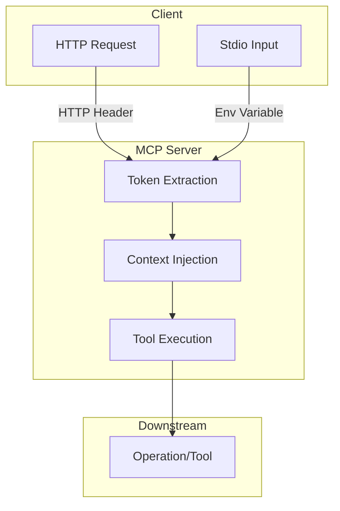

# Basic Token Passthrough MCP Server

This example demonstrates an MCP (Model Context Protocol) server that transparently passes authentication tokens through the context, supporting both HTTP and stdio transports. It is designed to show how tokens can be extracted from incoming requests or environment variables and made available to downstream tools and operations.

## Features

- **Token Passthrough:** Extracts authentication tokens from HTTP headers or environment variables and injects them into the request context.
- **Multiple Transports:** Supports `stdio` and `http` transports.
- **Tool Registration:** Registers example tools such as `make_authenticated_request` and `show_auth_token`.
- **Extensible:** Built on top of the [mcp-go](https://github.com/mark3labs/mcp-go) server library and integrates with the Gin web framework for HTTP handling.

## Architecture Overview



- **Token Extraction:**
  - For HTTP: Extracts token from request headers.
  - For stdio: Extracts token from environment variables.
- **Context Injection:**
  - Injects the token and a unique request ID into the context for each request.
- **Tool Execution:**
  - Tools can access the token from the context.

## File Structure

```bash
02-basic-token-passthrough/
├── server.go      # Main MCP server implementation
```

## Usage

### Build

```bash
go build -o mcp-server ./02-basic-token-passthrough
```

### Run

#### Stdio Transport (default)

```bash
./mcp-server
```

#### HTTP Transport

```bash
./mcp-server -t http -addr :8080
```

or

```bash
./mcp-server --transport http --addr :8080
```

### Command-Line Flags

| Flag          | Description                      | Default |
| ------------- | -------------------------------- | ------- |
| `-t`          | Transport type (`stdio`, `http`) | `stdio` |
| `--transport` | Same as `-t`                     | `stdio` |
| `-addr`       | Address to listen on (for HTTP)  | `:8080` |

### HTTP Endpoints

When running in HTTP mode, the server exposes the following endpoints:

- `POST /mcp`
- `GET /mcp`
- `DELETE /mcp`

All handled by the MCP server, with token extraction from HTTP headers.

## Implementation Details

See [`server.go`](02-basic-token-passthrough/server.go:1) for the full source.

### Key Components

- [`MCPServer`](02-basic-token-passthrough/server.go:24):  
  Wraps the underlying MCP server instance.

- [`NewMCPServer()`](02-basic-token-passthrough/server.go:30):  
  Creates and configures the MCP server, registering tools.

- [`ServeHTTP()`](02-basic-token-passthrough/server.go:49):  
  Returns a streamable HTTP server that injects the auth token from HTTP requests into the context.

- [`ServeStdio()`](02-basic-token-passthrough/server.go:64):  
  Starts the MCP server using stdio transport, injecting the auth token from the environment.

- [`main()`](02-basic-token-passthrough/server.go:71):  
  Parses CLI flags, selects the transport, and starts the server accordingly.

### Token Injection Logic

- **HTTP:**  
  Uses `core.AuthFromRequest(ctx, r)` to extract the token from the HTTP request and inject it into the context.

- **Stdio:**  
  Uses `core.AuthFromEnv(ctx)` to extract the token from environment variables.

- **Request ID:**  
  Each context is also assigned a unique request ID via `core.WithRequestID(ctx)` for traceability.

### Example: Registering Tools

```go
operation.RegisterAuthTool(mcpServer)
```

This line registers tools that can access the authentication token from the context.

## Extending

To add more tools or customize token handling, modify the registration logic in [`NewMCPServer()`](02-basic-token-passthrough/server.go:30) and the context injection logic in [`ServeHTTP()`](02-basic-token-passthrough/server.go:49) and [`ServeStdio()`](02-basic-token-passthrough/server.go:64).

## References

- [mcp-go/server](https://github.com/mark3labs/mcp-go)
- [Gin Web Framework](https://gin-gonic.com/)
- [Go Context Package](https://pkg.go.dev/context)
