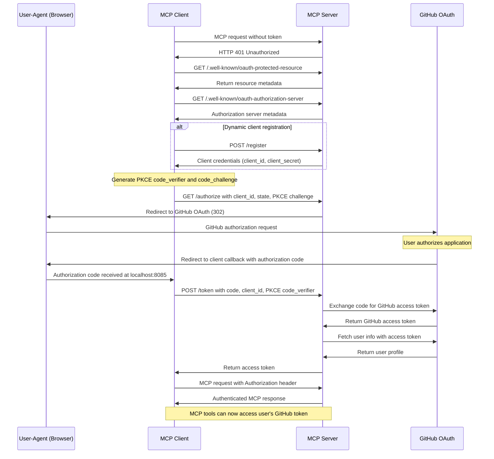
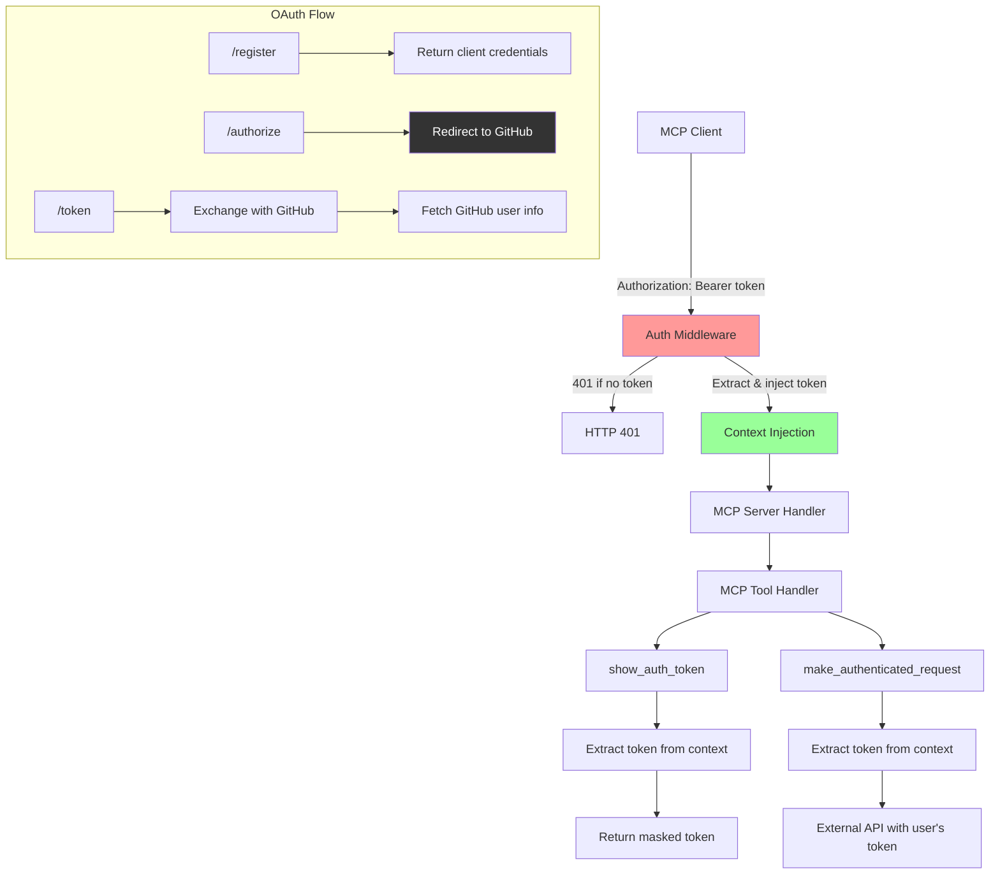

# OAuth MCP Server

This project demonstrates an OAuth 2.0 protected [Model Context Protocol (MCP)](https://github.com/mark3labs/mcp-go) server written in Go. It supports multiple OAuth providers (GitHub, GitLab, Gitea) and showcases authenticated MCP tool execution with token context propagation.

The implementation includes both an OAuth authorization server (`oauth-server/`) and an example OAuth client (`oauth-client/`), demonstrating the complete OAuth 2.0 flow with PKCE support and flexible storage options.

---

## Architecture Overview

The server provides:

- **Multi-Provider OAuth Integration**: Supports GitHub, GitLab, and Gitea as OAuth 2.0 providers for user authentication
- **Flexible Storage Backends**: Choose between in-memory or Redis-backed storage for OAuth data persistence
- **MCP Server with Authentication**: Requires valid OAuth tokens for all MCP endpoint access
- **Context-based Token Propagation**: Injects and propagates authentication tokens through Go's `context.Context`
- **Two Authenticated MCP Tools**:
  - `make_authenticated_request`: Makes authenticated HTTP requests to external APIs using the user's token
  - `show_auth_token`: Displays a masked version of the current authorization token
- **OAuth 2.0 Endpoints**: Implements required OAuth endpoints with provider integration
- **Dynamic Client Registration**: Supports automatic client registration for MCP clients

---

## Flowcharts

### OAuth Authorization Flow with GitHub Integration



---

## Process Flow Explanation

### 1. Authentication Middleware

- `authMiddleware` protects all `/mcp` routes, requiring a valid `Authorization` header
- Tokens are extracted via `core.AuthFromRequest` and injected into the request context
- Context propagation enables MCP tools to access the authenticated user's GitHub token

### 2. MCP Tools Implementation

#### make_authenticated_request

- Retrieves the GitHub access token from request context
- Makes authenticated HTTP requests to external APIs using the user's token
- Demonstrates how OAuth tokens flow through the MCP tool execution pipeline
- Useful for accessing GitHub APIs or other services on behalf of the authenticated user

#### show_auth_token

- Extracts the current access token from the execution context
- Returns a masked version showing only first and last 4 characters
- Demonstrates token availability within MCP tool handlers

### 3. Multi-Provider OAuth Integration

#### GitHub Provider

- **GitHubProvider**: Implements the `OAuthProvider` interface with GitHub-specific endpoints
- **Authorization**: Redirects to `https://github.com/login/oauth/authorize` with proper parameters
- **Token Exchange**: Exchanges authorization codes for GitHub access tokens via `https://github.com/login/oauth/access_token`
- **User Info**: Fetches user profile from `https://api.github.com/user` for validation and logging

#### GitLab Provider

- **GitLabProvider**: Implements the `OAuthProvider` interface with GitLab-specific endpoints
- **Authorization**: Redirects to `{gitlab_host}/oauth/authorize` with proper parameters
- **Token Exchange**: Exchanges authorization codes for GitLab access tokens via `{gitlab_host}/oauth/token`
- **User Info**: Fetches user profile from `{gitlab_host}/api/v4/user` for validation and logging
- **Self-hosted Support**: Configurable GitLab host for self-hosted instances

#### Gitea Provider

- **GiteaProvider**: Implements the `OAuthProvider` interface with Gitea-specific endpoints
- **Self-hosted Support**: Configurable Gitea host for self-hosted instances

### 4. OAuth 2.0 Endpoints

- `/.well-known/oauth-protected-resource`: MCP resource metadata for client discovery
- `/.well-known/oauth-authorization-server`: Authorization server metadata with supported features
- `/authorize`: Proxies authorization requests to GitHub with client credentials
- `/token`: Handles authorization code exchange, validates with GitHub, and returns tokens
- `/register`: Dynamic client registration endpoint that returns configured client credentials

---

## Server Architecture



---

## Getting Started

### Prerequisites

1. **Create a GitHub OAuth App**:
   - Go to GitHub Settings → Developer settings → OAuth Apps
   - Click "New OAuth App"
   - Set **Authorization callback URL** to: `http://localhost:8085/oauth/callback`
   - Note your **Client ID** and **Client Secret**

### Build & Run

1. Change to the server directory:

   ```bash
   cd 03-oauth-mcp/oauth-server
   ```

2. Start the server with your OAuth credentials:

   **GitHub (default with memory store):**

   ```bash
   go run . -client_id="your-github-client-id" -client_secret="your-github-client-secret"
   ```

   **GitHub with Redis store:**

   ```bash
   # Start Redis first
   docker run -d -p 6379:6379 redis:alpine

   # Run server with Redis
   go run . -client_id="your-id" -client_secret="your-secret" -store redis -redis-addr localhost:6379
   ```

   **GitLab.com:**

   ```bash
   go run . -provider="gitlab" -client_id="your-gitlab-client-id" -client_secret="your-gitlab-client-secret"
   ```

   **Self-hosted GitLab:**

   ```bash
   go run . -provider="gitlab" -gitlab-host="https://gitlab.example.com" -client_id="your-client-id" -client_secret="your-client-secret"
   ```

   **Gitea:**

   ```bash
   go run . -provider="gitea" -gitea-host="https://gitea.example.com" -client_id="your-client-id" -client_secret="your-client-secret"
   ```

3. Optional flags:

   ```bash
   go run . -client_id="your-id" -client_secret="your-secret" \
     -addr=":8095" \
     -log-level="INFO" \
     -store="redis" \
     -redis-addr="localhost:6379" \
     -redis-password="mypassword" \
     -redis-db=1
   ```

### Server Endpoints

| Endpoint                                  | Method          | Description                                 | Auth Required   |
| ----------------------------------------- | --------------- | ------------------------------------------- | --------------- |
| `/mcp`                                    | POST/GET/DELETE | MCP protocol endpoint                       | ✅ Bearer token |
| `/.well-known/oauth-protected-resource`   | GET             | Resource metadata                           | ❌              |
| `/.well-known/oauth-authorization-server` | GET             | OAuth server metadata                       | ❌              |
| `/authorize`                              | GET             | OAuth authorization (redirects to provider) | ❌              |
| `/token`                                  | POST            | Token exchange with OAuth provider          | ❌              |
| `/register`                               | POST            | Dynamic client registration                 | ❌              |

### Testing with curl

```bash
# Get OAuth metadata
curl http://localhost:8095/.well-known/oauth-authorization-server

# Get protected resource metadata
curl http://localhost:8095/.well-known/oauth-protected-resource

# Register a client
curl -X POST http://localhost:8095/register \
  -H "Content-Type: application/json" \
  -d '{
    "redirect_uris": ["http://localhost:8085/oauth/callback"],
    "grant_types": ["authorization_code"],
    "response_types": ["code"]
  }'

# Try MCP without token (should get 401)
curl -X POST http://localhost:8095/mcp

# Test with valid token (after OAuth flow)
curl -X POST http://localhost:8095/mcp \
  -H "Authorization: Bearer your-oauth-token" \
  -H "Content-Type: application/json"
```

---

## Implementation Details

### Key Components

- **`MCPServer`**: Wraps the mark3labs/mcp-go server with OAuth authentication
- **OAuth Providers**:
  - `GitHubProvider`: GitHub OAuth 2.0 integration
  - `GitLabProvider`: GitLab OAuth 2.0 integration with self-hosted support
  - `GiteaProvider`: Gitea OAuth 2.0 integration with self-hosted support
- **Storage Layer**:
  - `store.MemoryStore`: In-memory storage for development
  - `store.RedisStore`: Redis-backed persistent storage for production
  - Factory pattern for easy store creation
- **`authMiddleware`**: Gin middleware that enforces Authorization header requirements
- **Context Injection**: Uses `core.AuthFromRequest` to propagate tokens through request context

### File Structure

```txt
03-oauth-mcp/
├── oauth-server/
│   ├── server.go              # Main server with MCP and OAuth endpoints
│   ├── oauth_provider.go      # OAuth provider interface definition
│   ├── provider_github.go     # GitHub OAuth implementation
│   ├── provider_gitlab.go     # GitLab OAuth implementation
│   ├── provider_gitea.go      # Gitea OAuth implementation
│   ├── middleware.go          # Authentication middleware
│   ├── auth_meta.go           # Client registration metadata
│   └── README.md              # Server documentation
├── oauth-client/
│   ├── client.go              # OAuth MCP client example
│   └── README.md              # Client documentation
└── README.md                  # This file
```

### Security Features

- **PKCE Support**: Implements Proof Key for Code Exchange for enhanced security
- **State Parameter Validation**: Prevents CSRF attacks in OAuth flow
- **Token Masking**: Sensitive tokens are masked in logs and responses
- **CORS Configuration**: Proper CORS headers for cross-origin requests
- **Request Timeouts**: 30-second timeouts on all external HTTP requests
- **Client Secret Validation**: Validates client credentials before token exchange
- **Redirect URI Validation**: Ensures redirect URIs match registered URIs

### Storage Options

#### Memory Store

- **Pros**: No external dependencies, fast, simple setup
- **Cons**: Data lost on restart, not suitable for production with multiple instances
- **Use case**: Development and testing

#### Redis Store

- **Pros**: Persistent storage, production-ready, supports multiple server instances
- **Cons**: Requires Redis server
- **Use case**: Production deployments

See [oauth-server/README.md](oauth-server/README.md) for detailed storage configuration.

---

## Testing the Complete Flow

1. **Start the server** with your OAuth credentials:

   ```bash
   cd 03-oauth-mcp/oauth-server
   go run . -client_id="your-id" -client_secret="your-secret"
   ```

2. **Run the client** in a separate terminal:

   ```bash
   cd 03-oauth-mcp/oauth-client
   go run .
   ```

3. **Authorize the application** - the client will open your browser to the OAuth provider
4. **Observe the logs** showing successful token exchange and user info fetch
5. **See MCP tools execute** with the authenticated token

### Testing with Different Configurations

**Development setup (memory store):**

```bash
# Terminal 1: Server
cd 03-oauth-mcp/oauth-server
go run . -client_id=<id> -client_secret=<secret>

# Terminal 2: Client
cd 03-oauth-mcp/oauth-client
go run .
```

**Production setup (Redis store):**

```bash
# Terminal 1: Redis
docker run -d -p 6379:6379 redis:alpine

# Terminal 2: Server
cd 03-oauth-mcp/oauth-server
go run . -client_id=<id> -client_secret=<secret> -store redis -log-level INFO

# Terminal 3: Client
cd 03-oauth-mcp/oauth-client
go run .
```

---

## See Also

- [OAuth Server Documentation](oauth-server/README.md) - Detailed server configuration and storage options
- [OAuth Client Documentation](oauth-client/README.md) - Complete client implementation guide
- [Store Package](../pkg/store/README.md) - Storage layer implementation details

---

## Command-Line Flags

### Required Flags

- `-client_id`: OAuth 2.0 Client ID from your provider
- `-client_secret`: OAuth 2.0 Client Secret from your provider

### Optional Flags

- `-addr`: Server address (default: `:8095`)
- `-provider`: OAuth provider - `github`, `gitlab`, or `gitea` (default: `github`)
- `-gitea-host`: Gitea host URL (default: `https://gitea.com`)
- `-gitlab-host`: GitLab host URL (default: `https://gitlab.com`)
- `-log-level`: Log level - `DEBUG`, `INFO`, `WARN`, `ERROR` (default: `DEBUG`)
- `-store`: Storage type - `memory` or `redis` (default: `memory`)
- `-redis-addr`: Redis address (default: `localhost:6379`)
- `-redis-password`: Redis password (optional)
- `-redis-db`: Redis database number (default: `0`)

---

## References

- [MCP Documentation](https://mark3.ai/docs/mcp/)
- [OAuth 2.0 RFC6749](https://datatracker.ietf.org/doc/html/rfc6749)
- [PKCE RFC7636](https://datatracker.ietf.org/doc/html/rfc7636)
- [GitHub OAuth Apps](https://docs.github.com/en/apps/oauth-apps)
- [GitLab OAuth Documentation](https://docs.gitlab.com/ee/api/oauth2.html)
- [Gitea OAuth Documentation](https://docs.gitea.io/en-us/oauth2-provider/)
- [mark3labs/mcp-go](https://github.com/mark3labs/mcp-go)
- [Gin Web Framework](https://gin-gonic.com/)
- [Redis](https://redis.io/)
