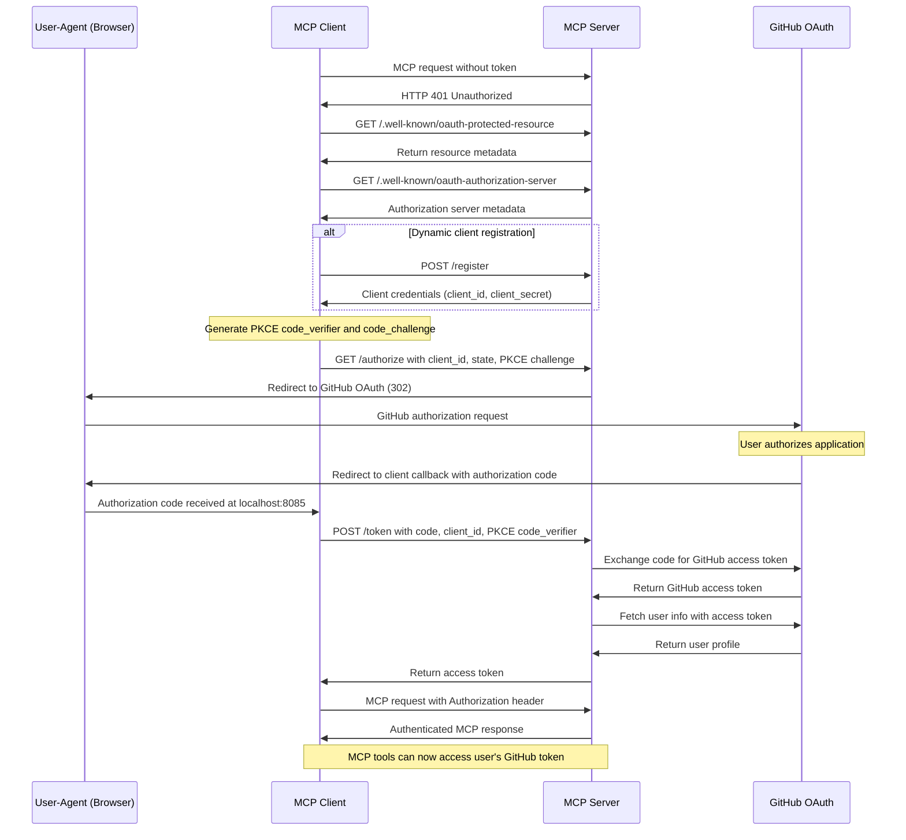
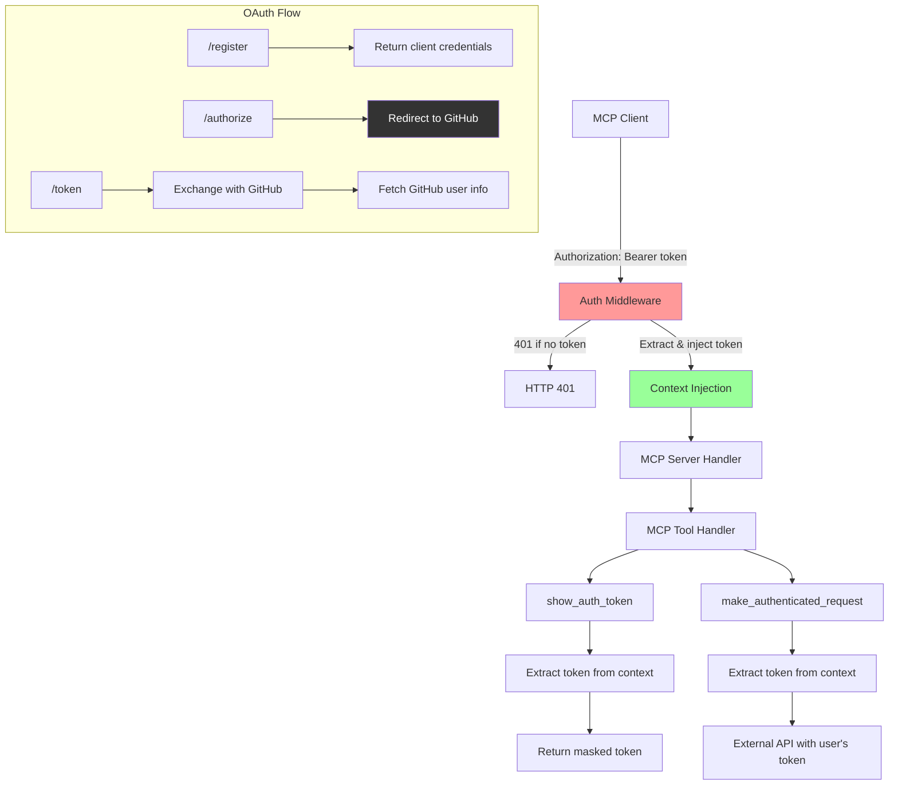

# OAuth MCP Server

This project demonstrates an OAuth 2.0 protected [Model Context Protocol (MCP)](https://github.com/mark3labs/mcp-go) server written in Go. It integrates with GitHub as the OAuth provider and showcases authenticated MCP tool execution with token context propagation.

---

## Architecture Overview

The server provides:

- **GitHub OAuth Integration**: Uses GitHub as the OAuth 2.0 provider for user authentication
- **MCP Server with Authentication**: Requires valid OAuth tokens for all MCP endpoint access
- **Context-based Token Propagation**: Injects and propagates authentication tokens through Go's `context.Context`
- **Two Authenticated MCP Tools**:
  - `make_authenticated_request`: Makes authenticated HTTP requests to external APIs using the user's token
  - `show_auth_token`: Displays a masked version of the current authorization token
- **OAuth 2.0 Endpoints**: Implements required OAuth endpoints with GitHub provider integration
- **Dynamic Client Registration**: Supports automatic client registration for MCP clients

---

## Flowcharts

### OAuth Authorization Flow with GitHub Integration



---

## Process Flow Explanation

### 1. Authentication Middleware

- `authMiddleware` protects all `/mcp` routes, requiring a valid `Authorization` header
- Tokens are extracted via `core.AuthFromRequest` and injected into the request context
- Context propagation enables MCP tools to access the authenticated user's GitHub token

### 2. MCP Tools Implementation

#### make_authenticated_request

- Retrieves the GitHub access token from request context
- Makes authenticated HTTP requests to external APIs using the user's token
- Demonstrates how OAuth tokens flow through the MCP tool execution pipeline
- Useful for accessing GitHub APIs or other services on behalf of the authenticated user

#### show_auth_token

- Extracts the current access token from the execution context
- Returns a masked version showing only first and last 4 characters
- Demonstrates token availability within MCP tool handlers

### 3. GitHub OAuth Provider Integration

- **GitHubProvider**: Implements the `OAuthProvider` interface with GitHub-specific endpoints
- **Authorization**: Redirects to `https://github.com/login/oauth/authorize` with proper parameters
- **Token Exchange**: Exchanges authorization codes for GitHub access tokens via `https://github.com/login/oauth/access_token`
- **User Info**: Fetches user profile from `https://api.github.com/user` for validation and logging

### 4. OAuth 2.0 Endpoints

- `/.well-known/oauth-protected-resource`: MCP resource metadata for client discovery
- `/.well-known/oauth-authorization-server`: Authorization server metadata with supported features
- `/authorize`: Proxies authorization requests to GitHub with client credentials
- `/token`: Handles authorization code exchange, validates with GitHub, and returns tokens
- `/register`: Dynamic client registration endpoint that returns configured client credentials

---

## Server Architecture



---

## Getting Started

### Prerequisites

1. **Create a GitHub OAuth App**:
   - Go to GitHub Settings → Developer settings → OAuth Apps
   - Click "New OAuth App"
   - Set **Authorization callback URL** to: `http://localhost:8085/oauth/callback`
   - Note your **Client ID** and **Client Secret**

### Build & Run

1. Change to the server directory:

   ```bash
   cd 03-oauth-mcp/server
   ```

2. Start the server with your GitHub OAuth credentials:

   ```bash
   go run server.go -client_id="your-github-client-id" -client_secret="your-github-client-secret"
   ```

3. Optional: Specify a different port:

   ```bash
   go run server.go -client_id="your-id" -client_secret="your-secret" -addr=":8095"
   ```

### Server Endpoints

| Endpoint | Method | Description | Auth Required |
|----------|--------|-------------|---------------|
| `/mcp` | POST/GET/DELETE | MCP protocol endpoint | ✅ Bearer token |
| `/.well-known/oauth-protected-resource` | GET | Resource metadata | ❌ |
| `/.well-known/oauth-authorization-server` | GET | OAuth server metadata | ❌ |
| `/authorize` | GET | GitHub OAuth authorization | ❌ |
| `/token` | POST | Token exchange with GitHub | ❌ |
| `/register` | POST | Dynamic client registration | ❌ |

### Testing with curl

```bash
# Get OAuth metadata
curl http://localhost:8095/.well-known/oauth-authorization-server

# Try MCP without token (should get 401)
curl -X POST http://localhost:8095/mcp

# Test with valid token (after OAuth flow)
curl -X POST http://localhost:8095/mcp \
  -H "Authorization: Bearer your-github-token" \
  -H "Content-Type: application/json"
```

---

## Implementation Details

### Key Components

- **`MCPServer`**: Wraps the mark3labs/mcp-go server with OAuth authentication
- **`GitHubProvider`**: Implements GitHub OAuth 2.0 integration with proper error handling
- **`authMiddleware`**: Gin middleware that enforces Authorization header requirements
- **Context Injection**: Uses `core.AuthFromRequest` to propagate tokens through request context

### File Structure

```txt
03-oauth-mcp/
├── server/
│   ├── server.go              # Main server with MCP and OAuth endpoints
│   ├── oauth_provider.go      # OAuth provider interface definition
│   └── provider_github.go     # GitHub OAuth implementation
├── client/
│   ├── client.go              # OAuth MCP client example
│   └── README.md              # Client documentation
└── README.md                  # This file
```

### Security Features

- **PKCE Support**: Implements Proof Key for Code Exchange for enhanced security
- **State Parameter Validation**: Prevents CSRF attacks in OAuth flow
- **Token Masking**: Sensitive tokens are masked in logs and responses
- **CORS Configuration**: Proper CORS headers for cross-origin requests
- **Request Timeouts**: 30-second timeouts on all external HTTP requests

---

## Testing the Complete Flow

1. **Start the server** with your GitHub OAuth credentials
2. **Run the client** - it will open your browser to GitHub
3. **Authorize the application** in GitHub
4. **Observe the logs** showing successful token exchange and user info fetch
5. **See MCP tools execute** with the authenticated GitHub token

---

## See Also

For detailed OAuth MCP Client implementation, features, and usage examples, see [`client/README.md`](client/README.md).

---

## References

- [MCP Documentation](https://mark3.ai/docs/mcp/)
- [OAuth 2.0 RFC6749](https://datatracker.ietf.org/doc/html/rfc6749)
- [GitHub OAuth Apps](https://docs.github.com/en/apps/oauth-apps)
- [mark3labs/mcp-go](https://github.com/mark3labs/mcp-go)
- [Gin Web Framework](https://gin-gonic.com/)
