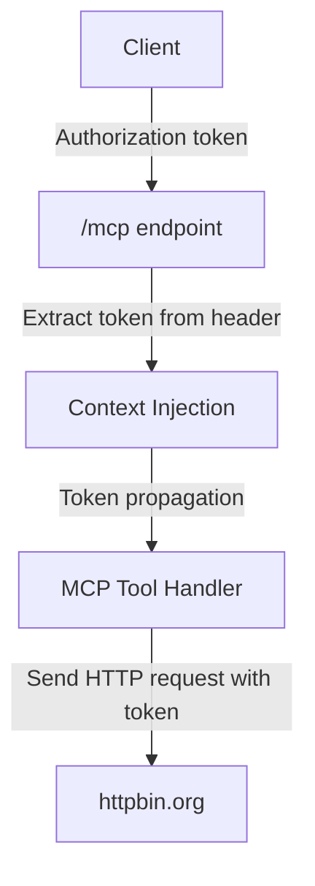

# OAuth MCP Server

This project demonstrates an OAuth 2.0 protected [Model Context Protocol (MCP)](https://github.com/mark3labs/mcp-go) server written in Go. It showcases authentication token handling via context for both HTTP and stdio transports, with sample endpoints and tools integrating OAuth flows and protected API calls.

---

## Architecture Overview

The server provides:

- A demonstration of a simple OAuth 2.0 service, including endpoints for authorization, token exchange, and protected resource metadata.
- Injection and propagation of authentication tokens using Go’s `context.Context`, supporting both HTTP and stdio transport.
- Two core MCP tools:
  - `make_authenticated_request`: Performs an authenticated request with the received token.
  - `show_auth_token`: Displays (masks) the current authorization token in the context.
- Example endpoints matching the OAuth 2.0 specification (`.well-known` endpoints, `/authorize`, `/token`, `/register`).

---

## Flowcharts

### OAuth Authorization Flow (Conceptual)


---

## Process Flow Explanation

### 1. HTTP Token Injection

- An `authMiddleware` is used on all `/mcp` routes, requiring an `Authorization` header.
- The token is extracted from the HTTP header and injected into the processing context (see `authFromRequest`).
- MCP tool handlers retrieve the token from context and use it when performing external API calls.

### 2. MCP Tools

#### make_authenticated_request

- Extracts the token from context and uses it as an `Authorization` header to send a request to [`https://httpbin.org/anything`](https://httpbin.org/anything), passing the `message` argument as a query parameter.
- Returns a summary of the request headers and parameters received, demonstrating token passing and context propagation.

#### show_auth_token

- Retrieves the current token from context and returns a masked version (first and last 4 characters).

### 3. OAuth 2.0 Flow Endpoints

- `/.well-known/oauth-protected-resource` and `/.well-known/oauth-authorization-server`: Provide resource and authorization server metadata for OAuth clients.
- `/authorize`: Redirects to a real OAuth authorization endpoint (e.g., GitHub) with the provided client ID and state.
- `/token`: Simulates token issuance for the `authorization_code` grant type.
- `/register`: Demo endpoint for dynamic client registration, echoing back client credentials.

---

## Key Server Logic (Simplified)



---

## Getting Started

### Build & Run

1. Change to the server directory:

    ```bash
    cd 03-oauth-mcp/server
    ```

2. Start the server (requires OAuth2 client ID and client secret):

    ```bash
    go run server.go -client_id="your-client-id" -client_secret="your-client-secret"
    ```

3. The server listens on `:8080` by default.

4. All requests to the `/mcp` endpoints **must** include an `Authorization` header.

### Exposed Endpoints

- `/mcp`: MCP protocol endpoint (supports POST, GET, DELETE; requires token).
- `/.well-known/oauth-authorization-server`: OAuth server metadata for automatic discovery.
- `/authorize`, `/token`, `/register`: Demo endpoints to cover basic OAuth flows.

---

## References

- [MCP Documentation](https://mark3.ai/docs/mcp/)
- [OAuth 2.0 RFC6749](https://datatracker.ietf.org/doc/html/rfc6749)
- Go Gin Web Framework

---

For implementation details, see [`server/server.go`](server/server.go:1).
