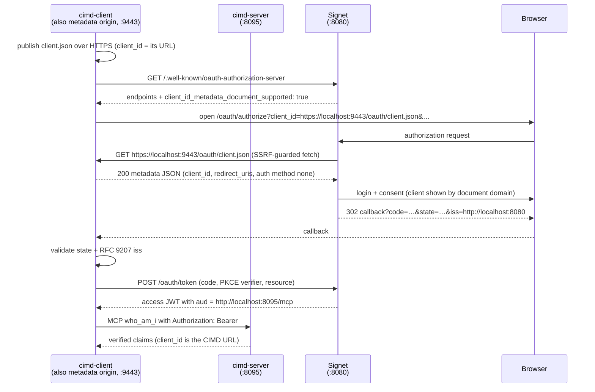

# CIMD — Client ID Metadata Documents for MCP

This sample demonstrates **CIMD (Client ID Metadata Document)** client
registration, the mechanism the MCP 2026-07-28 authorization spec references
([draft-ietf-oauth-client-id-metadata-document-00](https://datatracker.ietf.org/doc/html/draft-ietf-oauth-client-id-metadata-document-00)):
instead of pre-registering with the authorization server or calling a Dynamic
Client Registration endpoint, the client **hosts a JSON document whose URL is
the OAuth `client_id`**. The AS fetches that document during the authorization
request and materializes the client from it.

> **CIMD is not CIDR.** CIMD is a public HTTPS JSON document describing an
> OAuth client. CIDR (`10.0.0.0/8`) only shows up in the SSRF-guard part of
> the story, on the AS side.

Two binaries:

- **`cimd-client/`** — plays two roles at once: an HTTPS *client metadata
  origin* serving the document, and an MCP OAuth client running RFC 8414
  discovery, Authorization Code + S256 PKCE with the CIMD URL as `client_id`,
  RFC 9207 `iss` validation, and finally a Bearer-authenticated `who_am_i`
  call.
- **`cimd-server/`** — an ordinary MCP resource server (RFC 9728 protected
  resource metadata + local JWKS verification of Signet-issued JWTs).
  Deliberately contains **nothing CIMD-specific**: a resource server never
  sees the metadata document, it only verifies the resulting access token.

## Flow



## Do I need HTTPS?

Almost everything in this sample runs over plain HTTP — **except the metadata
document URL itself**:

| Component | Scheme | Why |
| --- | --- | --- |
| Signet issuer (`localhost:8080`) | HTTP OK | dev deployment |
| MCP resource server (`localhost:8095`) | HTTP OK | dev deployment |
| OAuth callback (`127.0.0.1:8085`) | HTTP OK | loopback redirect URIs may be HTTP even with `STRICT_REDIRECT_URIS=true` |
| **CIMD document URL (= `client_id`)** | **HTTPS required** | Signet's `IsCIMDClientID` predicate only recognizes `https` URLs as CIMD client_ids — there is no development-mode exception. A `http://…/client.json` client_id is treated as an unknown regular client and fails with `unauthorized_client`. |

[mkcert](https://github.com/FiloSottile/mkcert) makes this painless: it
installs a local CA into the system trust store, which is exactly what
Signet's fetcher (and this client's preflight self-check) uses to verify TLS.

## Prerequisites

1. A locally trusted certificate for the metadata origin:

   ```bash
   mkcert -install          # once: create + trust the local CA
   mkcert localhost         # produces localhost.pem / localhost-key.pem
   ```

2. A running [Signet](https://github.com/go-signet/signet) at
   `http://localhost:8080` with CIMD enabled and configured to reach a
   loopback metadata origin:

   ```bash
   CIMD_ENABLED=true
   CIMD_ALLOWED_RESOURCES=http://localhost:8095/mcp
   CIMD_ALLOW_PRIVATE_NETWORKS=true   # loopback-only dev testing; never in production
   ```

   - `CIMD_ENABLED` — off by default; when off Signet does not advertise
     `client_id_metadata_document_supported` and the client aborts early.
   - `CIMD_ALLOWED_RESOURCES` — the RFC 8707 `resource` this client requests
     must appear here **byte-for-byte** (trailing slash counts), otherwise the
     authorize request fails with `invalid_target`.
   - `CIMD_ALLOW_PRIVATE_NETWORKS` — Signet's SSRF guard rejects loopback and
     private addresses at dial time; this flag disables the guard so it can
     fetch `https://localhost:9443/…`. That guard is the production defense
     against attacker-controlled `client_id` URLs pointed at internal
     services, so only set this in isolated local development.

   Verify the capability is on:

   ```bash
   curl -s http://localhost:8080/.well-known/oauth-authorization-server \
     | jq '.client_id_metadata_document_supported'   # must be true
   ```

## Quick start

```bash
# terminal 1 — MCP resource server
go run ./03-oauth-mcp/cimd/cimd-server \
  -auth-server http://localhost:8080 \
  -resource    http://localhost:8095/mcp

# terminal 2 — CIMD client (run from the directory holding localhost.pem)
go run ./03-oauth-mcp/cimd/cimd-client \
  -auth-server http://localhost:8080 \
  -mcp-url     http://localhost:8095/mcp \
  -cimd-url    https://localhost:9443/oauth/client.json \
  -cert localhost.pem -key localhost-key.pem
```

No `-client_id` flag, no registration step, no client secret: the client
publishes this document at `https://localhost:9443/oauth/client.json` and that
URL *is* the client identity:

```json
{
  "client_id": "https://localhost:9443/oauth/client.json",
  "client_name": "CIMD Workshop Client",
  "redirect_uris": ["http://127.0.0.1:8085/callback"],
  "token_endpoint_auth_method": "none",
  "grant_types": ["authorization_code", "refresh_token"],
  "scope": "openid profile email"
}
```

Rules the document must follow (enforced by Signet, mirrored by this client's
`validateCIMDURL` and preflight self-check before the browser ever opens):

- `client_id` must be **byte-identical** to the URL the document is fetched
  from.
- The URL must be HTTPS with a hostname, a path more specific than `/`, no
  dot segments, no fragment, and no userinfo.
- Served directly with `200` — no redirects, no auth. Signet caps the size at
  64 KiB (the draft recommends < 5 KB).
- `token_endpoint_auth_method` must be empty or `none` — CIMD clients are
  always public clients; PKCE (S256) is the only proof at the token endpoint.
- 1–10 `redirect_uris` with exact-match comparison, so the callback listener
  uses a fixed port instead of `:0`.
- Signet intersects the declared `scope` with its user-safe set
  (`openid profile email offline_access`); custom scopes like `mcp:tools`
  are silently dropped in the current implementation.

## What to watch in the logs

- client: `client metadata document published` → the origin passed its own
  preflight (200, byte-identical `client_id`).
- client: `opening browser for authorization — Signet will now fetch the
  metadata document to resolve the client`.
- Signet consent page: identifies the client by the **document's domain**
  (`localhost`), not the self-asserted `client_name` — a name proves nothing.
- client: `iss OK` → RFC 9207 issuer check passed before the code was sent to
  the token endpoint.
- server: `audience verified` → the JWT's `aud` is the MCP resource, bound by
  the RFC 8707 `resource` parameter.
- client: `who_am_i` structured content shows `client_id` =
  `https://localhost:9443/oauth/client.json` — the CIMD URL made it all the
  way into the issued token.

## Troubleshooting

| Symptom | Likely cause | Check |
| --- | --- | --- |
| client aborts: `does not advertise client_id_metadata_document_supported` | CIMD disabled on Signet | `CIMD_ENABLED=true`, restart Signet |
| `metadata self-check failed` with TLS error | certificate not trusted | `mkcert -install`, cert covers the `-cimd-url` hostname |
| `unauthorized_client` at authorize | `client_id` not recognized as CIMD URL | scheme must be `https`, path more specific than `/` |
| `invalid_client` during authorization | Signet's fetch failed | Signet `component=cimd` logs; `CIMD_ALLOW_PRIVATE_NETWORKS=true` for loopback origins; direct 200; byte-identical `client_id` |
| `invalid_target` | resource not allowlisted | `CIMD_ALLOWED_RESOURCES` contains `-resource` byte-for-byte |
| `invalid_scope` / missing scopes | custom scopes dropped | only `openid profile email offline_access` survive for CIMD clients |
| token valid but cimd-server returns 401 | audience/issuer mismatch | `-resource` equals cimd-server's `-resource`; same Signet issuer on both sides |

## Tests

```bash
go test ./03-oauth-mcp/cimd/...
```

`cimd-client/cimd_test.go` covers the CIMD URL shape rules, byte-exact
`client_id` binding in the generated document, the origin handler's response
contract, and all RFC 9207 `iss` validation branches.

## References

- Signet docs: `http://localhost:8080/docs/zh-TW/cimd` — CIMD hosting,
  server-side implementation, and CIDR/SSRF safety
- [draft-ietf-oauth-client-id-metadata-document](https://datatracker.ietf.org/doc/draft-ietf-oauth-client-id-metadata-document/)
- [RFC 9728 — OAuth 2.0 Protected Resource Metadata](https://datatracker.ietf.org/doc/html/rfc9728)
- [RFC 8707 — Resource Indicators for OAuth 2.0](https://datatracker.ietf.org/doc/html/rfc8707)
- [RFC 9207 — OAuth 2.0 Authorization Server Issuer Identification](https://datatracker.ietf.org/doc/html/rfc9207)
- [RFC 7636 — Proof Key for Code Exchange](https://datatracker.ietf.org/doc/html/rfc7636)
