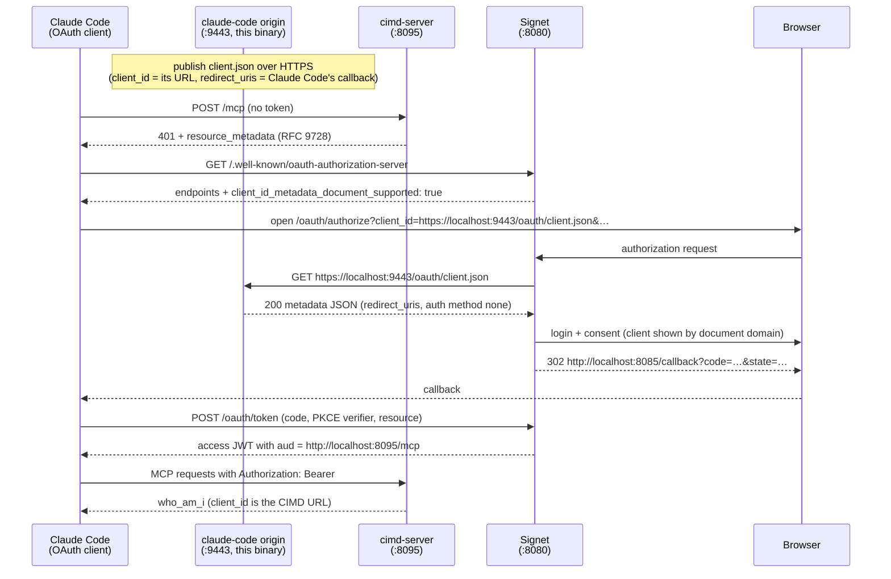

# Testing CIMD with Claude Code

This folder makes the CIMD sample testable from **Claude Code** instead of the
bundled `cimd-client`. Claude Code supports servers that use a **Client ID
Metadata Document (CIMD)**: you hand it a URL-shaped `client_id`, it passes
that URL as-is through the OAuth authorization-code flow, and the
authorization server (Signet) fetches the document to materialize the client.

The one thing Claude Code cannot do is _host_ that document — a CLI has no
long-lived HTTPS origin. In the `cimd-client` sample the OAuth client and the
metadata origin are the same process; here the roles are split:

| Role                                                                | cimd sample              | this test                 |
| ------------------------------------------------------------------- | ------------------------ | ------------------------- |
| OAuth client (browser flow, PKCE, token)                            | `cimd-client`            | **Claude Code**           |
| Client metadata origin (`https://localhost:9443/oauth/client.json`) | `cimd-client` (embedded) | **this binary**           |
| MCP resource server                                                 | `cimd-server`            | `cimd-server` (unchanged) |
| Authorization server                                                | Signet                   | Signet (unchanged)        |

The binary in this folder is that standalone origin: one HTTPS listener,
one JSON document, nothing else. Unlike `cimd-client`'s embedded origin it
stays up until you stop it — Signet re-fetches the `client_id` URL on **every**
authorization request, so the document must remain reachable for as long as
you keep re-authenticating from Claude Code.

## Flow



## Why the callback port must be fixed

By default Claude Code picks a **random available port** for its OAuth
callback (`http://localhost:PORT/callback`). CIMD redirect URIs are compared
by **exact match** — there is no registration step where a new port could be
announced — so a random port would never match the published document.

Both sides therefore pin the same port:

- Claude Code: `--callback-port 8085` (or `oauth.callbackPort` in `.mcp.json`)
- this origin: `-redirect-uris` defaults to
  `http://localhost:8085/callback,http://127.0.0.1:8085/callback`
  (both loopback spellings, so either form of the callback URL matches)

Port `8085` also happens to be `cimd-client`'s default callback port — stop
`cimd-client` before authenticating from Claude Code, or pick another port on
both sides.

## Prerequisites

Same as the main [cimd sample](../README.md):

1. A locally trusted certificate (run from the repo root, where the commands
   below expect the pems):

   ```bash
   mkcert -install          # once: create + trust the local CA
   mkcert localhost         # produces localhost.pem / localhost-key.pem
   ```

2. Signet at `http://localhost:8080` with:

   ```bash
   CIMD_ENABLED=true
   CIMD_ALLOWED_RESOURCES=http://localhost:8095/mcp
   CIMD_ALLOW_PRIVATE_NETWORKS=true   # loopback-only dev testing; never in production
   ```

3. Claude Code installed (`claude --version`).

## Quick start

All commands run from the repo root:

```bash
# terminal 1 — MCP resource server (unchanged from the cimd sample)
go run ./03-oauth-mcp/cimd/cimd-server \
  -auth-server http://localhost:8080 \
  -resource    http://localhost:8095/mcp

# terminal 2 — this metadata origin
go run ./03-oauth-mcp/cimd/claude-code \
  -cert localhost.pem -key localhost-key.pem
```

Then register the MCP server with Claude Code, pointing its `client_id` at
the published document:

```bash
claude mcp add --scope project --transport http \
  --client-id https://localhost:9443/oauth/client.json \
  --callback-port 8085 \
  cimd-server http://localhost:8095/mcp
```

or equivalently in `.mcp.json`:

```json
{
  "mcpServers": {
    "cimd-server": {
      "type": "http",
      "url": "http://localhost:8095/mcp",
      "oauth": {
        "clientId": "https://localhost:9443/oauth/client.json",
        "callbackPort": 8085
      }
    }
  }
}
```

Authenticate — either inside a Claude Code session:

```txt
/mcp        # pick cimd-server → Authenticate
```

or from the shell:

```bash
claude mcp login cimd-server
```

The browser opens Signet's consent page, which identifies the client by the
**document's domain** (`localhost`), fetched live from this origin. After
consent, Claude Code exchanges the code (PKCE `S256`, no client secret — the
document pins `token_endpoint_auth_method` to `none`) and calls the server's
`who_am_i` tool with the Bearer token; the verified claims show `client_id` =
`https://localhost:9443/oauth/client.json`.

## Flags

| Flag             | Default                                                         | Meaning                                                                         |
| ---------------- | --------------------------------------------------------------- | ------------------------------------------------------------------------------- |
| `-addr`          | `:9443`                                                         | HTTPS listen address; port must match `-cimd-url`                               |
| `-cimd-url`      | `https://localhost:9443/oauth/client.json`                      | the document URL = the OAuth `client_id`                                        |
| `-cert` / `-key` | `localhost.pem` / `localhost-key.pem`                           | mkcert pair, resolved relative to the working directory                         |
| `-client-name`   | `Claude Code`                                                   | display-only `client_name` in the document                                      |
| `-redirect-uris` | `http://localhost:8085/callback,http://127.0.0.1:8085/callback` | comma-separated, exact-match, 1–10 entries; must include Claude Code's callback |
| `-scopes`        | `openid profile email`                                          | Signet intersects with its user-safe set                                        |

## Troubleshooting

Everything in the main sample's
[troubleshooting table](../README.md#troubleshooting) applies. Claude Code
specifics:

| Symptom                                                             | Likely cause                                               | Fix                                                                                     |
| ------------------------------------------------------------------- | ---------------------------------------------------------- | --------------------------------------------------------------------------------------- |
| Signet rejects the callback (`invalid_request` / redirect mismatch) | Claude Code used a random callback port                    | set `--callback-port 8085` (or `oauth.callbackPort`) so it matches `-redirect-uris`     |
| `unauthorized_client` at authorize                                  | `oauth.clientId` not the CIMD URL, or the URL is not https | `clientId` must be exactly `https://localhost:9443/oauth/client.json`                   |
| `invalid_client`; Signet logs a fetch error                         | this origin not running, or its certificate untrusted      | keep terminal 2 running; `mkcert -install`; `CIMD_ALLOW_PRIVATE_NETWORKS=true`          |
| callback port already in use during login                           | `cimd-client` (or another run) holds `:8085`               | stop it, or change the port on both sides                                               |
| re-auth works, then fails later                                     | this origin was stopped after the first login              | Signet re-fetches the document on every authorization request — keep the origin running |

## Tests

```bash
go test ./03-oauth-mcp/cimd/claude-code/
```

Covers the multi-redirect-URI document contract (byte-exact `client_id`,
exact-match `redirect_uris`, public-client `token_endpoint_auth_method`), the
origin handler's response rules, and the `-redirect-uris` flag parsing.
