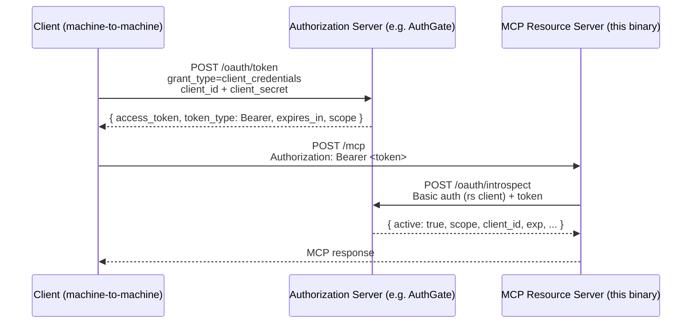

# OAuth 2.0 Client Credentials MCP Server

A minimal MCP server that implements the
[OAuth 2.0 Client Credentials extension](https://modelcontextprotocol.io/extensions/auth/oauth-client-credentials)
for machine-to-machine authentication, built with the official
[Model Context Protocol Go SDK](https://github.com/modelcontextprotocol/go-sdk)
**v1.5.0**.

The MCP server is only a **resource server**. It does **not** issue tokens or
host an OAuth authorization server. Clients obtain access tokens from a
separate authorization server such as
[AuthGate](https://github.com/go-authgate/authgate), then present them in the
`Authorization: Bearer ...` header. On each request this server validates the
token by calling the authorization server's
[RFC 7662 token introspection](https://datatracker.ietf.org/doc/html/rfc7662)
endpoint.

## Architecture



Concerns are cleanly separated:

- **Authorization server (AuthGate)** — owns credentials, issues and revokes
  tokens, hosts `/oauth/token`, `/oauth/introspect`,
  `/.well-known/openid-configuration`, `/.well-known/jwks.json`.
- **MCP resource server (this binary)** — owns tool implementations, validates
  each request's Bearer token via introspection, and advertises where its
  authorization server lives.

## Exposed endpoints

| Path                                    | Method | Auth   | Purpose                                                        |
| --------------------------------------- | ------ | ------ | -------------------------------------------------------------- |
| `/mcp`                                  | ANY    | Bearer | MCP streamable HTTP transport                                  |
| `/.well-known/oauth-protected-resource` | GET    | none   | RFC 9728 metadata pointing clients at the authorization server |

On a failed bearer check the SDK's `auth.RequireBearerToken` middleware
replies with `401 Unauthorized` and a
`WWW-Authenticate: Bearer resource_metadata="..."` header, as required by the
Protected Resource Metadata spec — clients that follow the spec can discover
the authorization server automatically.

## Tools

| Tool           | Description                                                          |
| -------------- | -------------------------------------------------------------------- |
| `echo_message` | Echoes a message back with the authenticated `client_id` and scopes. |
| `add_numbers`  | Returns the sum of two numbers.                                      |

Both handlers read `req.Extra.TokenInfo`, which the middleware populates from
the verifier's result.

## Running

The server needs credentials for its **own** client registration on the
authorization server — these are used as HTTP Basic credentials when calling
the introspection endpoint, and are distinct from any application client's
credentials.

```bash
go run ./03-oauth-mcp/client-credentials \
  -addr :8096 \
  -auth-server http://localhost:8080 \
  -introspect-client-id   mcp-resource \
  -introspect-client-secret rs-secret \
  -required-scopes 'mcp:read'
```

### Flags

| Flag                        | Default                          | Description                                                                |
| --------------------------- | -------------------------------- | -------------------------------------------------------------------------- |
| `-addr`                     | `:8096`                          | Address to listen on                                                       |
| `-resource`                 | `http://localhost<addr>/mcp`     | Public URL of this resource (echoed in metadata)                           |
| `-auth-server`              | `http://localhost:8080`          | Issuer URL of the external authorization server (e.g. AuthGate)            |
| `-introspection-url`        | `<auth-server>/oauth/introspect` | RFC 7662 introspection endpoint                                            |
| `-introspect-client-id`     | _(required)_                     | Client id this resource server uses to call the introspection endpoint     |
| `-introspect-client-secret` | _(required)_                     | Client secret this resource server uses to call the introspection endpoint |
| `-required-scopes`          | `mcp:read`                       | Space-separated scopes required on every MCP request                       |
| `-log-level`                | `INFO`                           | `DEBUG`, `INFO`, `WARN`, or `ERROR`                                        |

## End-to-end flow with AuthGate

1. **Run AuthGate** on port 8080 and register two clients:
   - `mcp-resource` / `rs-secret` — this MCP server, granted the `introspect`
     scope (or whatever your AuthGate deployment requires for calling
     `/oauth/introspect`).
   - `my-service` / `s3cr3t` — the application calling MCP, granted scopes
     `mcp:read mcp:write`.

2. **Run the MCP server**:

   ```bash
   go run ./03-oauth-mcp/client-credentials \
     -auth-server http://localhost:8080 \
     -introspect-client-id mcp-resource \
     -introspect-client-secret rs-secret
   ```

3. **Fetch a token from AuthGate**:

   ```bash
   TOKEN=$(curl -s -X POST http://localhost:8080/oauth/token \
     -u my-service:s3cr3t \
     -d 'grant_type=client_credentials' \
     -d 'scope=mcp:read mcp:write' | jq -r .access_token)
   ```

4. **Call the MCP server**:

   ```bash
   curl -s -X POST http://localhost:8096/mcp \
     -H "Authorization: Bearer $TOKEN" \
     -H 'Content-Type: application/json' \
     -H 'Accept: application/json, text/event-stream' \
     -d '{
       "jsonrpc":"2.0","id":1,"method":"initialize",
       "params":{
         "protocolVersion":"2025-06-18",
         "capabilities":{},
         "clientInfo":{"name":"curl","version":"1.0"}
       }
     }'
   ```

An unauthenticated call returns the discoverable 401:

```bash
curl -i -X POST http://localhost:8096/mcp -H 'Content-Type: application/json' -d '{}'
# HTTP/1.1 401 Unauthorized
# Www-Authenticate: Bearer resource_metadata="http://localhost:8096/.well-known/oauth-protected-resource", scope="mcp:read"
```

## Verification client (Go)

A companion client under [`client/`](client/client.go) exercises the full
flow using the same Go SDK. It:

1. Sends an unauthenticated `POST /mcp` and asserts the response is `401` with
   a proper `WWW-Authenticate: Bearer resource_metadata="..."` header.
2. Fetches an access token from the authorization server using
   `golang.org/x/oauth2/clientcredentials` (grant: `client_credentials`).
3. Connects to the MCP server with `mcp.StreamableClientTransport`, passing
   the OAuth-aware `*http.Client` so every request carries a Bearer token (and
   is refreshed automatically when it expires).
4. Calls `list_tools`, then invokes both `echo_message` and `add_numbers`,
   printing text and structured content from each result.

Run it against a live MCP server + authorization server:

```bash
go run ./03-oauth-mcp/client-credentials/client \
  -mcp-url http://localhost:8096/mcp \
  -auth-server http://localhost:8080 \
  -client_id my-service \
  -client_secret s3cr3t \
  -scopes 'mcp:read mcp:write'
```

Expected output (abbreviated):

```txt
msg="unauthenticated probe returned 401 as expected" www_authenticate="Bearer resource_metadata=..."
msg=connected server_name=client-credentials-mcp-server
msg="available tools" tools="[add_numbers echo_message]"
msg="tool structured content" tool=echo_message json={"client_id":"my-service","message":"hello from go-sdk","scopes":["mcp:read","mcp:write"]}
msg="tool structured content" tool=add_numbers json={"sum":42}
msg="verification complete"
```

The `echo_message` output proves the token round-trip: the scopes and
`client_id` printed by the tool come from `req.Extra.TokenInfo`, which the
server populated from AuthGate's introspection response.

### Client flags

| Flag                 | Default                     | Description                            |
| -------------------- | --------------------------- | -------------------------------------- |
| `-mcp-url`           | `http://localhost:8096/mcp` | MCP streamable HTTP endpoint           |
| `-auth-server`       | `http://localhost:8080`     | Issuer URL of the authorization server |
| `-token-url`         | `<auth-server>/oauth/token` | OAuth 2.0 token endpoint               |
| `-client_id`         | `my-service`                | Application OAuth client id            |
| `-client_secret`     | `s3cr3t`                    | Application OAuth client secret        |
| `-scopes`            | `mcp:read mcp:write`        | Scopes to request                      |
| `-skip-unauth-check` | `false`                     | Skip the 401-probe step                |
| `-log-level`         | `INFO`                      | `DEBUG`, `INFO`, `WARN`, `ERROR`       |

## Verification client (Python)

A companion client under [`client-python/`](client-python/client.py) exercises
the same flow using the official
[Python MCP SDK](https://github.com/modelcontextprotocol/python-sdk)
(`mcp >= 1.27`) and its `ClientCredentialsOAuthProvider` extension. Dependencies
are managed with [uv](https://docs.astral.sh/uv/).

What the client does:

1. Builds an `InMemoryTokenStorage` (the extension requires a `TokenStorage`).
2. Constructs a `ClientCredentialsOAuthProvider` with the MCP server URL, the
   application's `client_id`/`client_secret`, and the desired scopes.
3. Passes the provider to `streamablehttp_client(..., auth=provider)`. The
   provider is an `httpx.Auth` implementation, so httpx calls it on every
   request: it performs RFC 9728 / RFC 8414 discovery, fetches the token via
   the `client_credentials` grant, attaches the Bearer header, and refreshes
   on expiry.
4. Calls `list_tools`, then `call_tool("echo_message", ...)` and
   `call_tool("add_numbers", ...)`.

Run it against a live MCP server + authorization server:

```bash
cd 03-oauth-mcp/client-credentials/client-python
uv sync
uv run python client.py \
  --mcp-url http://localhost:8096/mcp \
  --client-id my-service \
  --client-secret s3cr3t \
  --scopes 'mcp:read mcp:write'
```

Expected output (abbreviated):

```txt
connecting to http://localhost:8096/mcp ...
connected: client-credentials-mcp-server v1.0.0
available tools: ['add_numbers', 'echo_message']
[echo_message] text: {"client_id":"my-service","message":"hello from python-sdk","scopes":["mcp:read"]}
[echo_message] structured: {"client_id": "my-service", "message": "hello from python-sdk", "scopes": ["mcp:read"]}
[add_numbers] text: {"sum":42}
[add_numbers] structured: {"sum": 42}
verification complete
```

### Python client flags

| Flag              | Default                     | Description                                          |
| ----------------- | --------------------------- | ---------------------------------------------------- |
| `--mcp-url`       | `http://localhost:8096/mcp` | MCP streamable HTTP endpoint                         |
| `--client-id`     | `my-service`                | OAuth client id                                      |
| `--client-secret` | `s3cr3t`                    | OAuth client secret                                  |
| `--scopes`        | `mcp:read mcp:write`        | Space-separated scopes to request                    |
| `--auth-method`   | `client_secret_basic`       | Either `client_secret_basic` or `client_secret_post` |

### Requirements on the authorization server

The Python SDK's `ClientCredentialsOAuthProvider` performs full OAuth 2.0
discovery before hitting the token endpoint, so the authorization server must
expose:

- `/.well-known/oauth-authorization-server` (RFC 8414), validated by the SDK
  against its `OAuthMetadata` model. Required fields include `issuer`,
  **`authorization_endpoint`** (even though it is unused for
  `client_credentials`), and `token_endpoint`.
- A `client_credentials` `token_endpoint` compatible with RFC 6749 §4.4.

Production [AuthGate](https://github.com/go-authgate/authgate) already exposes
these; a fake authorization server used in tests must include them too.

## Implementation notes

- **SDK:** `github.com/modelcontextprotocol/go-sdk/mcp` for the server,
  `github.com/modelcontextprotocol/go-sdk/auth` for `RequireBearerToken`.
- **Verifier:** a small HTTP client that POSTs `token=...` to
  `<auth-server>/oauth/introspect` with Basic-auth credentials and maps the
  response into `auth.TokenInfo` (`Scopes`, `Expiration`, `UserID`, and
  `Extra["client_id"]`).
- **Scope enforcement:** done by `RequireBearerTokenOptions.Scopes`, not in
  individual tool handlers — so scope changes are a one-line edit.
- **No tokens are issued here.** The server holds no session or credential
  state of its own; restarting it does not invalidate any user's tokens.

## Alternatives

- **JWKS verification.** If AuthGate signs access tokens as JWTs, the resource
  server can fetch `/.well-known/jwks.json` and verify signatures locally,
  avoiding a network round-trip per request. Swap the `introspector` for a
  JWKS-backed verifier and keep the rest of the server unchanged.
- **Caching.** A production deployment should cache introspection results
  (keyed by token) for a short window to avoid hammering the authorization
  server.

## Security caveats

- Front with HTTPS; this example serves plain HTTP.
- Store the resource-server's introspection credentials in a secret manager;
  do not commit them.
- Add rate limiting, request logging, and token-result caching before
  production use.
