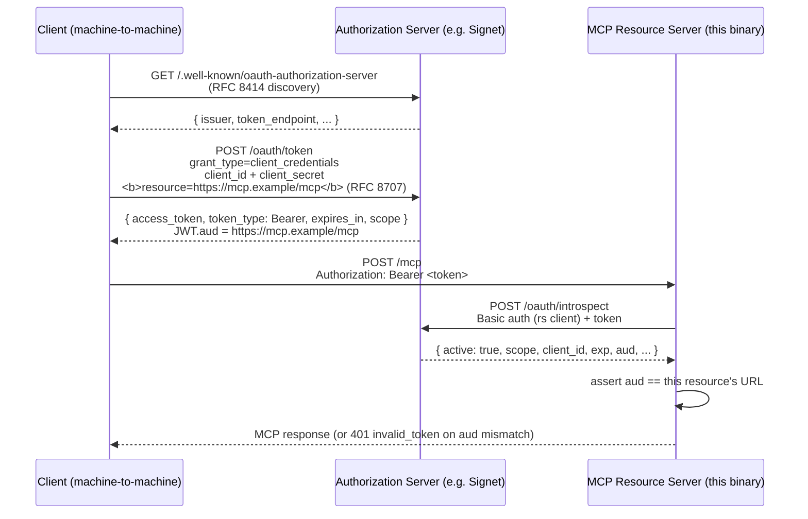

# OAuth 2.0 Client Credentials MCP Server

A minimal MCP server that implements the
[OAuth 2.0 Client Credentials extension](https://modelcontextprotocol.io/extensions/auth/oauth-client-credentials)
for machine-to-machine authentication, built with the official
[Model Context Protocol Go SDK](https://github.com/modelcontextprotocol/go-sdk)
**v1.5.0**.

The MCP server is only a **resource server**. It does **not** issue tokens or
host an OAuth authorization server. Clients obtain access tokens from a
separate authorization server such as
[Signet](https://github.com/go-signet/signet), then present them in the
`Authorization: Bearer ...` header. On each request this server validates the
token by calling the authorization server's
[RFC 7662 token introspection](https://datatracker.ietf.org/doc/html/rfc7662)
endpoint.

## Architecture



### Two server variants ship in this directory

| Variant                              | Verifier                                | Per-request cost            | Revocation visibility | Dependencies                                                         |
| ------------------------------------ | --------------------------------------- | --------------------------- | --------------------- | -------------------------------------------------------------------- |
| [`server.go`](server.go)             | RFC 7662 introspection (HTTP roundtrip) | 1 HTTPS call to issuer      | Instant               | None beyond the MCP SDK                                              |
| [`server-jwks/`](server-jwks/) (new) | JWKS signature verification, local      | Microseconds (after warmup) | Bounded by token TTL  | `github.com/go-signet/sdk-go/jwksauth` (OIDC discovery at startup) |

Pick **introspection** when access-token lifetimes are long, you need instant
revocation, or you do not want extra dependencies. Pick **JWKS** when tokens
are short-lived (minutes), you can tolerate a revocation window equal to the
TTL, and you want to scale horizontally without per-request issuer traffic.

Concerns are cleanly separated:

- **Authorization server (Signet)** — owns credentials, issues and revokes
  tokens, hosts `/oauth/token`, `/oauth/introspect`,
  `/.well-known/oauth-authorization-server` (RFC 8414),
  `/.well-known/openid-configuration`, `/.well-known/jwks.json`.
- **MCP resource server (this binary)** — owns tool implementations, validates
  each request's Bearer token (introspection or JWKS), **enforces that the
  token's `aud` claim equals its own resource URL**, and advertises where its
  authorization server lives.

### Why the `aud` check matters with `client_credentials`

Signet's MCP guide is explicit: the `client_credentials` grant **has no
per-client resource allowlist**. Any client that can mint a token from this
authorization server can mint one against any `resource` value it asks for,
and that token will pass signature/`iss`/`exp` verification at _any_ MCP
resource server fronted by the same issuer.

The defence is RFC 8707 + audience checking:

1. The client passes `resource=<MCP-URL>` on the token request (RFC 8707
   resource indicator). Signet copies that value into the JWT's `aud`
   claim and into the introspection response.
2. The resource server compares the token's `aud` to its own configured
   resource URL on every request. Anything else is rejected with `401
invalid_token`.

If the resource server _omits_ this check (the previous version of this
example did), it accepts tokens minted for other resource servers and is
open to cross-RS token replay.

## Exposed endpoints

| Path                                    | Method | Auth   | Purpose                                                        |
| --------------------------------------- | ------ | ------ | -------------------------------------------------------------- |
| `/mcp`                                  | ANY    | Bearer | MCP streamable HTTP transport                                  |
| `/.well-known/oauth-protected-resource` | GET    | none   | RFC 9728 metadata pointing clients at the authorization server |

On a failed bearer check the SDK's `auth.RequireBearerToken` middleware
replies with `401 Unauthorized` and a
`WWW-Authenticate: Bearer resource_metadata="..."` header, as required by the
Protected Resource Metadata spec — clients that follow the spec can discover
the authorization server automatically.

## Tools

| Tool           | Description                                                          |
| -------------- | -------------------------------------------------------------------- |
| `echo_message` | Echoes a message back with the authenticated `client_id` and scopes. |
| `add_numbers`  | Returns the sum of two numbers.                                      |

Both handlers read `req.Extra.TokenInfo`, which the middleware populates from
the verifier's result.

## Running

The server needs credentials for its **own** client registration on the
authorization server — these are used as HTTP Basic credentials when calling
the introspection endpoint, and are distinct from any application client's
credentials.

```bash
go run ./03-oauth-mcp/client-credentials \
  -addr :8096 \
  -auth-server http://localhost:8080 \
  -introspect-client-id   mcp-resource \
  -introspect-client-secret rs-secret \
  -required-scopes 'mcp:read'
```

### Flags

| Flag                        | Default                          | Description                                                                                                                              |
| --------------------------- | -------------------------------- | ---------------------------------------------------------------------------------------------------------------------------------------- |
| `-addr`                     | `:8096`                          | Address to listen on                                                                                                                     |
| `-resource`                 | `http://localhost<addr>/mcp`     | Public URL of this resource. Echoed in `/.well-known/oauth-protected-resource` **and** used as the expected `aud` value on every request |
| `-auth-server`              | `http://localhost:8080`          | Issuer URL of the external authorization server (e.g. Signet)                                                                          |
| `-introspection-url`        | `<auth-server>/oauth/introspect` | RFC 7662 introspection endpoint                                                                                                          |
| `-introspect-client-id`     | _(required)_                     | Client id this resource server uses to call the introspection endpoint                                                                   |
| `-introspect-client-secret` | _(required)_                     | Client secret this resource server uses to call the introspection endpoint                                                               |
| `-required-scopes`          | `mcp:read`                       | Space-separated scopes required on every MCP request                                                                                     |
| `-require-resource-binding` | `false`                          | When `true`, reject tokens whose introspection response has no `aud` claim. When `false`, accept them with a WARN log                    |
| `-log-level`                | `INFO`                           | `DEBUG`, `INFO`, `WARN`, or `ERROR`                                                                                                      |

## End-to-end flow with Signet

The canonical walkthrough uses Signet at `https://signet.local:8080`
with its self-signed cert already trusted in the system trust store. The
default `-auth-server` value stays `http://localhost:8080` so the example
also works against an ad-hoc AS without TLS.

1. **Run Signet** at `https://signet.local:8080` and register two clients:
   - `mcp-resource` / `rs-secret` — this MCP server, granted the `introspect`
     scope (or whatever your Signet deployment requires for calling
     `/oauth/introspect`).
   - `my-service` / `s3cr3t` — the application calling MCP, granted scopes
     `mcp:read mcp:write`.

2. **Run the MCP server** with explicit `-resource` and resource binding
   enforced:

   ```bash
   go run ./03-oauth-mcp/client-credentials \
     -auth-server https://signet.local:8080 \
     -resource https://mcp.example/mcp \
     -require-resource-binding=true \
     -introspect-client-id mcp-resource \
     -introspect-client-secret rs-secret
   ```

3. **Fetch a token from Signet** with the RFC 8707 `resource` parameter:

   ```bash
   TOKEN=$(curl -s -X POST https://signet.local:8080/oauth/token \
     -u my-service:s3cr3t \
     -d 'grant_type=client_credentials' \
     -d 'scope=mcp:read mcp:write' \
     -d 'resource=https://mcp.example/mcp' | jq -r .access_token)
   ```

4. **Inspect the JWT's `aud` claim** to confirm the binding worked:

   ```bash
   echo "$TOKEN" | cut -d. -f2 | base64 --decode 2>/dev/null | jq .aud
   # "https://mcp.example/mcp"
   ```

5. **Call the MCP server**:

   ```bash
   curl -s -X POST http://localhost:8096/mcp \
     -H "Authorization: Bearer $TOKEN" \
     -H 'Content-Type: application/json' \
     -H 'Accept: application/json, text/event-stream' \
     -d '{
       "jsonrpc":"2.0","id":1,"method":"initialize",
       "params":{
         "protocolVersion":"2025-06-18",
         "capabilities":{},
         "clientInfo":{"name":"curl","version":"1.0"}
       }
     }'
   ```

   The server logs `audience verified expected_aud=https://mcp.example/mcp
got_aud=[https://mcp.example/mcp]` on every accepted request.

An unauthenticated call returns the discoverable 401:

```bash
curl -i -X POST http://localhost:8096/mcp -H 'Content-Type: application/json' -d '{}'
# HTTP/1.1 401 Unauthorized
# Www-Authenticate: Bearer resource_metadata="http://localhost:8096/.well-known/oauth-protected-resource", scope="mcp:read"
```

A request with a token bound to a _different_ resource is rejected with the
same `401`, and the server logs `audience mismatch`.

## Verification client (Go)

A companion client under [`client/`](client/client.go) exercises the full
flow using the same Go SDK. It:

1. Sends an unauthenticated `POST /mcp` and asserts the response is `401` with
   a proper `WWW-Authenticate: Bearer resource_metadata="..."` header.
2. Fetches an access token from the authorization server using
   `golang.org/x/oauth2/clientcredentials` (grant: `client_credentials`).
3. Connects to the MCP server with `mcp.StreamableClientTransport`, passing
   the OAuth-aware `*http.Client` so every request carries a Bearer token (and
   is refreshed automatically when it expires).
4. Calls `list_tools`, then invokes both `echo_message` and `add_numbers`,
   printing text and structured content from each result.

It also performs **RFC 8414** discovery: when `-token-url` is not set, the
client fetches `<auth-server>/.well-known/oauth-authorization-server` and
uses the advertised `token_endpoint`. If that fetch fails, it falls back to
`<auth-server>/oauth/token` and logs a WARN so workshop users running an
ad-hoc AS without metadata are not blocked.

And it sends the **RFC 8707** `resource=<MCP-URL>` parameter on every token
request. The value comes from `-resource` (defaulting to `-mcp-url`), and
Signet binds it to the issued JWT's `aud` claim. This is what makes the
server's `aud` check pass.

Run it against a live MCP server + authorization server:

```bash
go run ./03-oauth-mcp/client-credentials/client \
  -mcp-url http://localhost:8096/mcp \
  -resource https://mcp.example/mcp \
  -auth-server https://signet.local:8080 \
  -client_id my-service \
  -client_secret s3cr3t \
  -scopes 'mcp:read mcp:write'
```

Expected output (abbreviated):

```txt
msg="unauthenticated probe returned 401 as expected" www_authenticate="Bearer resource_metadata=..."
msg=connected server_name=client-credentials-mcp-server
msg="available tools" tools="[add_numbers echo_message]"
msg="tool structured content" tool=echo_message json={"client_id":"my-service","message":"hello from go-sdk","scopes":["mcp:read","mcp:write"]}
msg="tool structured content" tool=add_numbers json={"sum":42}
msg="verification complete"
```

The `echo_message` output proves the token round-trip: the scopes and
`client_id` printed by the tool come from `req.Extra.TokenInfo`, which the
server populated from Signet's introspection response.

### Client flags

| Flag                 | Default                                    | Description                                                                                              |
| -------------------- | ------------------------------------------ | -------------------------------------------------------------------------------------------------------- |
| `-mcp-url`           | `http://localhost:8096/mcp`                | MCP streamable HTTP endpoint                                                                             |
| `-auth-server`       | `http://localhost:8080`                    | Issuer URL of the authorization server                                                                   |
| `-token-url`         | _(RFC 8414 discovery from `-auth-server`)_ | Override the discovered `token_endpoint`. Falls back to `<auth-server>/oauth/token` with WARN on failure |
| `-resource`          | _(value of `-mcp-url`)_                    | RFC 8707 resource indicator sent on the token request. Becomes the JWT's `aud` claim                     |
| `-client_id`         | `my-service`                               | Application OAuth client id                                                                              |
| `-client_secret`     | `s3cr3t`                                   | Application OAuth client secret                                                                          |
| `-scopes`            | `mcp:read mcp:write`                       | Scopes to request                                                                                        |
| `-skip-unauth-check` | `false`                                    | Skip the 401-probe step                                                                                  |
| `-log-level`         | `INFO`                                     | `DEBUG`, `INFO`, `WARN`, `ERROR`                                                                         |

## Verification client (Python)

A companion client under [`client-python/`](client-python/client.py) exercises
the same flow using the official
[Python MCP SDK](https://github.com/modelcontextprotocol/python-sdk)
(`mcp >= 1.28.1`) and its `ClientCredentialsOAuthProvider` extension. Dependencies
are managed with [uv](https://docs.astral.sh/uv/).

What the client does:

1. Builds an `InMemoryTokenStorage` (the extension requires a `TokenStorage`).
2. Constructs a `ClientCredentialsOAuthProvider` with the MCP server URL, the
   application's `client_id`/`client_secret`, and the desired scopes.
3. Passes the provider to `streamablehttp_client(..., auth=provider)`. The
   provider is an `httpx.Auth` implementation, so httpx calls it on every
   request: it performs RFC 9728 / RFC 8414 discovery, fetches the token via
   the `client_credentials` grant, attaches the Bearer header, and refreshes
   on expiry.
4. Calls `list_tools`, then `call_tool("echo_message", ...)` and
   `call_tool("add_numbers", ...)`.

### `resource` is auto-derived — no code change needed

The Python script in this repo does **not** explicitly pass `resource`, and
yet RFC 8707 binding still works. The MCP Python SDK (`mcp >= 1.28.1`) auto-
derives `resource` from `server_url` via `OAuthContext.get_resource_url()`
inside `src/mcp/client/auth/extensions/client_credentials.py` and emits it
on the token request whenever
`should_include_resource_param()` is true — which holds here because the
resource server publishes Protected Resource Metadata (RFC 9728) and the
MCP protocol version is ≥ 2025-06-18.

**This means the value passed to `--mcp-url` is what gets bound as the
JWT's `aud` claim.** Pass the _canonical_ resource URL — the same value
the server is started with via `-resource` — so the audience check
matches. If the SDK normalises the URL (e.g. strips a trailing slash or
lower-cases the host), the server's `-resource` flag value must match the
normalised form, or the server rejects with `401 audience mismatch`.

There is no clean override hook in the Python SDK
(no `extra_token_params`, no `on_token_request`); the only way to inject a
different `resource` value would be to subclass and copy
`_exchange_token_client_credentials`. For this example, just align
`--mcp-url` with the server's `-resource` and let the SDK handle it.

Run it against a live MCP server + authorization server:

```bash
cd 03-oauth-mcp/client-credentials/client-python
uv sync
uv run python client.py \
  --mcp-url http://localhost:8096/mcp \
  --client-id my-service \
  --client-secret s3cr3t \
  --scopes 'mcp:read mcp:write'
```

Expected output (abbreviated):

```txt
connecting to http://localhost:8096/mcp ...
connected: client-credentials-mcp-server v1.0.0
available tools: ['add_numbers', 'echo_message']
[echo_message] text: {"client_id":"my-service","message":"hello from python-sdk","scopes":["mcp:read"]}
[echo_message] structured: {"client_id": "my-service", "message": "hello from python-sdk", "scopes": ["mcp:read"]}
[add_numbers] text: {"sum":42}
[add_numbers] structured: {"sum": 42}
verification complete
```

### Python client flags

| Flag              | Default                     | Description                                          |
| ----------------- | --------------------------- | ---------------------------------------------------- |
| `--mcp-url`       | `http://localhost:8096/mcp` | MCP streamable HTTP endpoint                         |
| `--client-id`     | `my-service`                | OAuth client id                                      |
| `--client-secret` | `s3cr3t`                    | OAuth client secret                                  |
| `--scopes`        | `mcp:read mcp:write`        | Space-separated scopes to request                    |
| `--auth-method`   | `client_secret_basic`       | Either `client_secret_basic` or `client_secret_post` |

### Requirements on the authorization server

The Python SDK's `ClientCredentialsOAuthProvider` performs full OAuth 2.0
discovery before hitting the token endpoint, so the authorization server must
expose:

- `/.well-known/oauth-authorization-server` (RFC 8414), validated by the SDK
  against its `OAuthMetadata` model. Required fields include `issuer`,
  **`authorization_endpoint`** (even though it is unused for
  `client_credentials`), and `token_endpoint`.
- A `client_credentials` `token_endpoint` compatible with RFC 6749 §4.4.

Production [Signet](https://github.com/go-signet/signet) already exposes
these; a fake authorization server used in tests must include them too.

## Implementation notes

- **SDK:** `github.com/modelcontextprotocol/go-sdk/mcp` for the server,
  `github.com/modelcontextprotocol/go-sdk/auth` for `RequireBearerToken`.
- **Verifier:** a small HTTP client that POSTs `token=...` to
  `<auth-server>/oauth/introspect` with Basic-auth credentials and maps the
  response into `auth.TokenInfo` (`Scopes`, `Expiration`, `UserID`,
  `Extra["client_id"]`, and `Extra["aud"]`). The `aud` field is decoded as
  either a string or `[]string` per RFC 7662 §2.2.
- **Audience enforcement:** the verifier compares the token's `aud` to the
  server's `-resource` value on every request. With
  `-require-resource-binding=true` the server also rejects tokens whose
  introspection response carries no `aud` at all — relevant whenever the
  authorization server (Signet included) lets the `client_credentials`
  grant fall back to a static `JWT_AUDIENCE`. See the Signet
  [MCP integration guide](https://github.com/go-signet/signet) for the
  multi-resource-server caveat.
- **Scope enforcement:** done by `RequireBearerTokenOptions.Scopes`, not in
  individual tool handlers — so scope changes are a one-line edit.
- **No tokens are issued here.** The server holds no session or credential
  state of its own; restarting it does not invalidate any user's tokens.

## JWKS verifier variant (`server-jwks/`)

[`server-jwks/server.go`](server-jwks/server.go) is the same MCP server with
the introspection verifier swapped for a local JWKS verifier built on
[`github.com/go-signet/sdk-go/jwksauth`](https://github.com/go-signet/sdk-go).
The MCP SDK's `auth.RequireBearerToken` stays the outer middleware; the
SDK's verifier is wrapped in a small adapter (`jwksVerifier.Verify`) that
satisfies the SDK's `Verify(ctx, token, *http.Request) (*auth.TokenInfo, error)`
signature. Tool handlers are unchanged.

What the adapter does on every request:

1. Calls `jwksauth.Verifier.Verify(ctx, token)` — this validates the JWT
   signature against the cached JWKS, plus the standard `iss`, `aud`, `exp`,
   and `nbf` checks.
2. **Re-decodes the raw payload** to read the `type` claim and rejects the
   token if `type != "access"`. Signet's SDK does not surface `type` on
   its parsed `Claims` struct, but Signet's MCP guide warns that without
   this check a _refresh_ JWT presented as a Bearer would otherwise pass
   signature, `iss`, `aud`, and `exp` checks unchanged.
3. Re-checks the audience explicitly so the success and failure paths emit
   the same `audience verified` / `audience mismatch` log lines as the
   introspection server, with `expected_aud` and `got_aud` fields.

```bash
go run ./03-oauth-mcp/client-credentials/server-jwks \
  -addr :8097 \
  -resource https://mcp.example/mcp \
  -auth-server https://signet.local:8080
```

OIDC discovery runs once at startup against `-auth-server` (15s timeout).
If the authorization server is not reachable, `server-jwks` refuses to
start — start Signet first. The same Go and Python clients work against
this binary; only the address changes.

### JWKS variant flags

| Flag                    | Default                      | Description                                                                                                        |
| ----------------------- | ---------------------------- | ------------------------------------------------------------------------------------------------------------------ |
| `-addr`                 | `:8097`                      | Address to listen on (default differs from introspection variant so both can run side by side)                     |
| `-resource`             | `http://localhost<addr>/mcp` | Public URL of this resource. Used both in metadata and as the required `aud` value                                 |
| `-auth-server`          | `http://localhost:8080`      | Issuer URL — OIDC discovery target at startup                                                                      |
| `-required-scopes`      | `mcp:read`                   | Space-separated scopes required on every MCP request                                                               |
| `-private-claim-prefix` | `extra`                      | Must match Signet's `JWT_PRIVATE_CLAIM_PREFIX`. If your deployment overrides it, set this flag to the same value |
| `-discovery-timeout`    | `15s`                        | OIDC discovery timeout at startup                                                                                  |
| `-verify-timeout`       | `5s`                         | Per-request JWT verification timeout (bounds JWKS fetch on cache miss)                                             |
| `-log-level`            | `INFO`                       | `DEBUG`, `INFO`, `WARN`, `ERROR`                                                                                   |

### Introspection vs. JWKS — when to pick which

| Concern                        | Introspection (`server.go`)                             | JWKS (`server-jwks/`)                                                   |
| ------------------------------ | ------------------------------------------------------- | ----------------------------------------------------------------------- |
| Per-request cost               | 1 HTTPS round-trip to issuer                            | Microseconds (signature verify in-process)                              |
| Revocation visibility          | Instant                                                 | Bounded by access-token TTL (no revocation between checks)              |
| Issuer availability dependence | Per request — issuer outage = 5xx                       | Per request: none after warmup. Startup: required for discovery         |
| Horizontal scaling             | Limited by issuer rate                                  | Trivial — verification is local                                         |
| Dependency footprint           | None beyond the MCP SDK                                 | `github.com/go-signet/sdk-go` + `go-oidc/v3` (transitive)             |
| Refresh-as-access protection   | Issuer enforces (introspection returns `active: false`) | **Caller must check `type=="access"` explicitly** — done by the adapter |

## Alternatives

- **Caching introspection.** A production deployment of the introspection
  variant should cache responses (keyed by token) for a short window so the
  authorization server is not hit on every MCP request.

## Security caveats

- Front with HTTPS; this example serves plain HTTP.
- Store the resource-server's introspection credentials in a secret manager;
  do not commit them.
- Add rate limiting, request logging, and token-result caching before
  production use.
