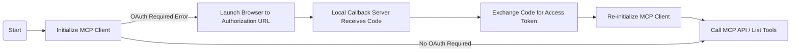

# OAuth MCP Client

This application demonstrates an OAuth 2.0 client that integrates with an MCP-enabled OAuth server. It performs the OAuth Authorization Code flow (with PKCE), interacts with the MCP server using authenticated HTTP requests, and showcases dynamic registration, local callback handling, and tool discovery via the MCP protocol.

---

## Features

- **Full OAuth 2.0 Authorization Code Flow with PKCE:**
  - Launches your browser for user authentication.
  - Hosts a local server to receive the OAuth callback for capturing authorization codes.
  - Handles state, PKCE, and (optionally) dynamic client registration.
- **Token Management:** Stores received tokens in-memory (can be extended to persistent storage).
- **MCP Protocol Integration:** Initializes with the MCP server, manages OAuth handshake, and lists available tools with authorized requests.
- **Clear Logging:** All actions and errors are logged to the terminal for easy debugging.

---

## OAuth Client Flow



---

## Detailed Flow

1. **Initialize Client**  
   The client configures and starts with the MCP server, specifying server URL, redirect URI, and scopes. Initial handshake attempts a protocol initialization.

2. **OAuth Authorization Flow**  
   If the server indicates authorization is needed:
   - PKCE parameters and a state string are generated.
   - Dynamic registration is attempted if no client credentials are preset.
   - Authorization URL is opened in the browser.
   - A local HTTP server (`:8085`) waits for the OAuth callback with the code.

3. **Token Exchange**  
   After user authorization, the code is received, verified for the correct state, and exchanged for an access token using PKCE verifier.

4. **Re-initialize and Use MCP APIs**  
   With a valid token, the client re-initializes to the MCP server and lists available tools, demonstrating fully authorized API interaction.

---

## Getting Started

### Prerequisites

- Ensure the OAuth MCP server is running and reachable at the server URL.
- Optionally, register your client credentials in advance, or let the client perform dynamic registration.

### Usage

1. Change to the client directory:

    ```bash
    cd 03-oauth-mcp/client
    ```

2. Start the client:

    ```bash
    go run client.go
    ```

    - The client will open your default browser for OAuth authorization.
    - It will start a local HTTP server at `http://localhost:8085/oauth/callback` to handle the authorization code.
    - If successful, you will see a success message in your browser, and tool information in the terminal.

---

## References

- [MCP Documentation](https://mark3.ai/docs/mcp/)
- [OAuth 2.0 RFC6749](https://datatracker.ietf.org/doc/html/rfc6749)
- [Client Source Code](client.go)

---
