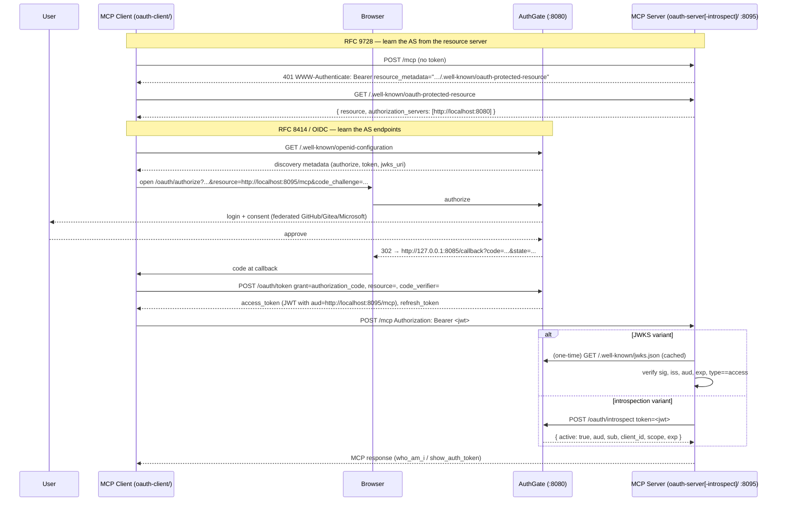

# OAuth 2.1 Authorization Code + PKCE MCP Resource Server

This example demonstrates the **Authorization Code + PKCE** flow split: an
[AuthGate](https://github.com/go-authgate/authgate) instance issues OAuth
tokens, and this MCP server validates them. The MCP server itself issues no
tokens.

Two server variants are provided, mirroring the split already used in
[`../client-credentials/`](../client-credentials/):

| Variant                                                | Token verification         | When to use                                                          |
| ------------------------------------------------------ | -------------------------- | -------------------------------------------------------------------- |
| [`oauth-server/`](oauth-server/)                       | **Local JWKS** (offline)   | Default. Lowest latency, no extra hop per request, no shared secret. |
| [`oauth-server-introspect/`](oauth-server-introspect/) | **RFC 7662 introspection** | When revocations must propagate immediately.                         |

A matching example client lives in [`oauth-client/`](oauth-client/). It runs
the full Authorization Code + PKCE flow with **RFC 8707 `resource=` binding**
so the issued JWT's `aud` claim matches what the resource server enforces.

---

## What changed from the old `dcr/`

If you have used this directory before, the rewrite is a hard
backward-incompatible cut, by design:

- The MCP server no longer hosts `/authorize`, `/token`, `/register`, or
  `/.well-known/oauth-authorization-server`. Those endpoints live on AuthGate.
- The MCP server publishes only RFC 9728 Protected Resource Metadata at
  `/.well-known/oauth-protected-resource`, pointing clients at AuthGate.
- The `make_authenticated_request` tool — which previously called GitHub
  on behalf of the user using their upstream GitHub access token — is
  removed (see **Gap A** below) and replaced with `who_am_i`, which
  surfaces the verified JWT's claims.
- The `-provider=gitlab` flag is removed; GitLab is not currently a
  federated identity provider in AuthGate (see **Gap B** below).
- The `mark3labs/mcp-go` dependency is no longer imported by anything in
  this directory. The server is built on
  [`github.com/modelcontextprotocol/go-sdk`](https://github.com/modelcontextprotocol/go-sdk).
- The `pkg/store`, `pkg/core`, and `pkg/operation` packages are not imported
  here either — the rewrite is closer to ~250 lines per binary instead of
  ~600 lines for the old custom OAuth server.

If you need the old self-contained behaviour, `git revert` is the cleanest
path; it predates these changes.

---

## Gaps you should know about

### Gap A — Upstream provider tokens are not available to MCP tools

The previous `make_authenticated_request` tool worked because the old
`oauth-server/` stored the **user's GitHub access token** from the federated
login and exposed it via the request context. AuthGate's contract is
different: it federates GitHub / Gitea / Microsoft Entra ID for **login**
but issues its **own JWT** to relying parties. The MCP server never sees
a GitHub PAT.

AuthGate v0.11 does not expose upstream provider tokens to relying parties
at runtime (the admin UI exposes connections at `/admin/users/:id/connections`,
but that is an admin-only operation, not a callable API). This example
therefore replaces `make_authenticated_request` with `who_am_i`, which
returns claims from the verified JWT — including AuthGate's server-attested
extras (`extra_uid`, `extra_domain`, …). If your MCP tool needs to call a
downstream API on behalf of the user, the AuthGate-blessed pattern is to
use a Client Credentials grant from the MCP server back to AuthGate for an
audience that the downstream API trusts.

A future AuthGate enhancement that exposes upstream tokens via a new
`/oauth/userinfo/connections` endpoint would close this gap; out of scope
for this example.

### Gap B — No GitLab identity provider on AuthGate

AuthGate ships GitHub, Gitea, and Microsoft Entra ID as upstream OAuth
providers today. GitLab is not yet supported. Anyone who reached the old
`dcr/` looking for a `-provider=gitlab` flag should know that AuthGate is
the place to add a GitLab provider, not this example. The provider choice
is configured server-side on AuthGate (see
[AuthGate's `docs/OAUTH_SETUP.md`](https://github.com/go-authgate/authgate/blob/main/docs/OAUTH_SETUP.md));
this `dcr/` example is provider-agnostic.

---

## Architecture

The flow follows the
[MCP authorization spec](https://modelcontextprotocol.io/specification/2025-11-25/basic/authorization):
the client does **not** assume where the authorization server lives. It first
hits the MCP server with no token, gets a `401` whose `WWW-Authenticate` header
points at the [RFC 9728](https://datatracker.ietf.org/doc/html/rfc9728)
Protected Resource Metadata, reads the `authorization_servers` from that
metadata, and only then runs OIDC/RFC 8414 discovery against the AS it was told
to use.



> **On `-auth-server`:** the example client still accepts an `-auth-server`
> flag, but it is now only a **fallback**. The client always attempts the
> RFC 9728 probe-and-fetch above first (`discoverAuthServer` in
> [`oauth-client/client.go`](oauth-client/client.go)); it falls back to
> `-auth-server` only if the MCP server returns no usable Protected Resource
> Metadata. In a fully spec-compliant deployment the flag can be dropped.

The server's responsibilities reduce to:

1. **RFC 9728 metadata** at `/.well-known/oauth-protected-resource`,
   pointing clients at AuthGate.
2. **Bearer-token verification** via
   `auth.RequireBearerToken` from
   [`github.com/modelcontextprotocol/go-sdk/auth`](https://pkg.go.dev/github.com/modelcontextprotocol/go-sdk/auth),
   with one of two underlying verifiers.
3. **MCP tools** that read the verified `auth.TokenInfo` from the request
   context — never the raw bearer.

---

## JWKS vs Introspection

| Aspect                                | JWKS ([`oauth-server/`](oauth-server/))                         | Introspection ([`oauth-server-introspect/`](oauth-server-introspect/)) |
| ------------------------------------- | --------------------------------------------------------------- | ---------------------------------------------------------------------- |
| Network calls per request             | 0 (after one-time JWKS fetch at startup)                        | 1 (POST to `/oauth/introspect`)                                        |
| Token revocation propagation          | Bounded by JWT `exp` (no immediate revocation)                  | Immediate (introspection returns `active: false`)                      |
| Requires shared secret on RS          | No                                                              | Yes (`-introspect-client-id` / `-introspect-client-secret`)            |
| RFC 8707 `aud` check                  | Yes (the `jwksauth.Verifier` enforces it intrinsically)         | Yes (we decode `aud` from the introspection response)                  |
| Refresh-token-as-access-token defence | Yes (we check the `type == "access"` claim explicitly)          | Yes implicitly (refresh tokens introspect as `active: false`)          |
| Resource-server boot dep              | OIDC discovery (`/.well-known/openid-configuration`) + JWKS URL | OIDC discovery for the introspection endpoint                          |
| Sensible default                      | **This one**                                                    | When immediate revocation matters more than per-request latency        |

Both variants enforce that the JWT was minted for **this** resource by
requiring `aud == -resource`. Without that check, any AuthGate-issued
token would be accepted by any MCP server sharing the same issuer.

---

## Prerequisites

This example assumes an AuthGate instance reachable at `http://localhost:8080`
(or `https://authgate.local:8080` if you mirror the deployment used in
`../client-credentials/`). At minimum the AuthGate `.env` should set:

```ini
ENABLE_DYNAMIC_CLIENT_REGISTRATION=true   # only if you want the oauth-client to self-register
OAUTH_GITHUB_CLIENT_ID=...                # or any other federated provider
OAUTH_GITHUB_CLIENT_SECRET=...
JWT_PRIVATE_CLAIM_PREFIX=extra            # default; pass -private-claim-prefix to override
```

A minimal `docker run` line:

```bash
docker run --rm -p 8080:8080 \
  -e OAUTH_GITHUB_CLIENT_ID=... \
  -e OAUTH_GITHUB_CLIENT_SECRET=... \
  -e ENABLE_DYNAMIC_CLIENT_REGISTRATION=true \
  ghcr.io/go-authgate/authgate:latest
```

Register a client for this example (or rely on DCR via `POST /oauth/register`
from the example client). Make sure the client's registered redirect URI
includes `http://127.0.0.1:8085/callback`.

---

## Quickstart — JWKS variant

```bash
# Terminal 1: AuthGate (see above)

# Terminal 2: MCP resource server (JWKS, local verification)
go run ./03-oauth-mcp/dcr/oauth-server \
  -auth-server http://localhost:8080 \
  -resource http://localhost:8095/mcp

# Terminal 3: example client
go run ./03-oauth-mcp/dcr/oauth-client \
  -auth-server http://localhost:8080 \
  -mcp-url http://localhost:8095/mcp \
  -client_id <your-registered-client-id> \
  -client_secret <client-secret-if-confidential> \
  -scopes "openid profile email"
```

The client opens a browser to AuthGate, you log in via the federated
provider, the browser redirects to `127.0.0.1:8085/callback`, the client
exchanges the code for a token with `resource=http://localhost:8095/mcp`,
and then calls `who_am_i` / `show_auth_token` on the MCP server.

## Quickstart — introspection variant

```bash
# Terminal 2: MCP resource server (introspection)
go run ./03-oauth-mcp/dcr/oauth-server-introspect \
  -auth-server http://localhost:8080 \
  -resource http://localhost:8095/mcp \
  -introspect-client-id mcp-resource \
  -introspect-client-secret rs-secret
```

The client command from above works unchanged; only the server differs.

---

## MCP tools

| Tool              | Behaviour                                                                                                                |
| ----------------- | ------------------------------------------------------------------------------------------------------------------------ |
| `who_am_i`        | Returns subject, client id, issuer, audience(s), scopes, and AuthGate-attested extras (`uid`, `domain`, …) from the JWT. |
| `show_auth_token` | Returns a masked hint about the bearer (subject + client id) — never the raw token.                                      |

Both tools read the verified `auth.TokenInfo` from `req.Extra.TokenInfo`.
Neither makes outbound calls (see Gap A).

---

## Curl walkthrough

The steps below mirror the spec flow: a token-less request gets a `401` that
points at the Protected Resource Metadata, which in turn names the AS.

```bash
# 1. Unauthenticated request → 401 carrying the RFC 9728 hint
curl -i -X POST http://localhost:8095/mcp \
  -H "Content-Type: application/json" \
  -d '{"jsonrpc":"2.0","id":1,"method":"initialize","params":{}}'
#   → HTTP/1.1 401 Unauthorized
#     WWW-Authenticate: Bearer resource_metadata="http://localhost:8095/.well-known/oauth-protected-resource"

# 2. Follow the hint: fetch protected-resource metadata, read authorization_servers
curl -s http://localhost:8095/.well-known/oauth-protected-resource \
  | jq '{resource, authorization_servers}'

# 3. Discover the AS endpoints from the authorization_servers entry
curl -s http://localhost:8080/.well-known/openid-configuration \
  | jq '{authorization_endpoint, token_endpoint, introspection_endpoint, jwks_uri}'

# 4. With a JWT bound to the wrong audience: 401 invalid_token, server logs "audience mismatch"
TOKEN=...  # from a token exchange where you sent resource=http://localhost:9999/mcp
curl -i -X POST http://localhost:8095/mcp \
  -H "Authorization: Bearer $TOKEN" -H "Content-Type: application/json" \
  -d '{"jsonrpc":"2.0","id":1,"method":"initialize","params":{}}'
```

---

## Verification matrix

| Test                                                                                          | JWKS | Introspection                                      |
| --------------------------------------------------------------------------------------------- | ---- | -------------------------------------------------- |
| Happy path: auth-code + PKCE, `who_am_i` returns user claims, server logs `audience verified` | ✅    | ✅                                                  |
| Token bound to wrong `resource=`: 401, server logs `audience mismatch`                        | ✅    | ✅                                                  |
| Refresh JWT replayed as access token: 401, server logs `non-access token rejected`            | ✅    | n/a (refresh tokens introspect as `active: false`) |
| `go vet ./...`, `golangci-lint run ./...`, `make`, `make test`                                | ✅    | ✅                                                  |

Run the unit tests for the dcr/ directory:

```bash
go test ./03-oauth-mcp/dcr/...
```

---

## Server flags

### Both variants

| Flag               | Default                      | Meaning                                                                   |
| ------------------ | ---------------------------- | ------------------------------------------------------------------------- |
| `-addr`            | `:8095`                      | TCP address to listen on.                                                 |
| `-resource`        | `http://localhost<addr>/mcp` | Public URL of this MCP resource. Also the audience the verifier requires. |
| `-auth-server`     | `http://localhost:8080`      | Issuer URL of the upstream AS.                                            |
| `-required-scopes` | _(none)_                     | Space-separated scopes a token must contain.                              |
| `-log-level`       | `INFO`                       | `DEBUG` / `INFO` / `WARN` / `ERROR`.                                      |

### JWKS variant only (`oauth-server/`)

| Flag                    | Default | Meaning                                                                 |
| ----------------------- | ------- | ----------------------------------------------------------------------- |
| `-private-claim-prefix` | `extra` | Must match AuthGate's `JWT_PRIVATE_CLAIM_PREFIX`.                       |
| `-discovery-timeout`    | `15s`   | Bounds the OIDC discovery call at startup.                              |
| `-verify-timeout`       | `5s`    | Per-request JWT verification timeout (bounds JWKS fetch on cache miss). |

### Introspection variant only (`oauth-server-introspect/`)

| Flag                        | Default        | Meaning                                                                  |
| --------------------------- | -------------- | ------------------------------------------------------------------------ |
| `-introspect-client-id`     | _(required)_   | RS credentials for calling `POST /oauth/introspect`.                     |
| `-introspect-client-secret` | _(required)_   | RS credentials for calling `POST /oauth/introspect`.                     |
| `-introspection-url`        | _(discovered)_ | Override RFC 7662 endpoint. Default: OIDC discovery from `-auth-server`. |
| `-require-resource-binding` | `true`         | Reject tokens whose introspection response has no `aud` claim.           |
| `-discovery-timeout`        | `15s`          | Bounds the OIDC discovery call at startup.                               |
| `-introspect-timeout`       | `5s`           | Per-request introspection HTTP timeout.                                  |

---

## Client flags (`oauth-client/`)

| Flag             | Default                                    | Meaning                                                                    |
| ---------------- | ------------------------------------------ | -------------------------------------------------------------------------- |
| `-mcp-url`       | `http://localhost:8095/mcp`                | MCP streamable HTTP endpoint.                                              |
| `-auth-server`   | `http://localhost:8080`                    | **Fallback** AS issuer URL. The client first discovers the AS via RFC 9728 (401 → protected-resource-metadata) and only uses this if that fails. |
| `-resource`      | _(= `-mcp-url`)_                           | RFC 8707 resource indicator sent on `/oauth/authorize` and `/oauth/token`. |
| `-client_id`     | _(required)_                               | OAuth client_id registered with the AS.                                    |
| `-client_secret` | _(blank)_                                  | Optional; omit for public clients (PKCE is always used).                   |
| `-scopes`        | `openid profile email`                     | Scopes to request.                                                         |
| `-token-file`    | `~/.cache/dcr-mcp-client/<client_id>.json` | Where to persist tokens via `credstore.NewTokenFileStore`.                 |
| `-callback-port` | `8085`                                     | Local TCP port for the OAuth callback.                                     |
| `-force-reauth`  | `false`                                    | Ignore the cached token and always run the interactive flow.               |

---

## See also

- [`../client-credentials/`](../client-credentials/) — the machine-to-machine
  variant of this same split.
- [AuthGate docs](https://github.com/go-authgate/authgate/tree/main/docs) —
  `MCP.md`, `OAUTH_SETUP.md`.
- [RFC 8707](https://datatracker.ietf.org/doc/html/rfc8707) — resource
  indicators.
- [RFC 9728](https://datatracker.ietf.org/doc/html/rfc9728) — protected
  resource metadata.
- [Model Context Protocol Go SDK](https://github.com/modelcontextprotocol/go-sdk).
- [`go-authgate/sdk-go`](https://github.com/go-authgate/sdk-go) — `jwksauth`,
  `middleware`, `discovery`, `credstore`, `authflow`.
