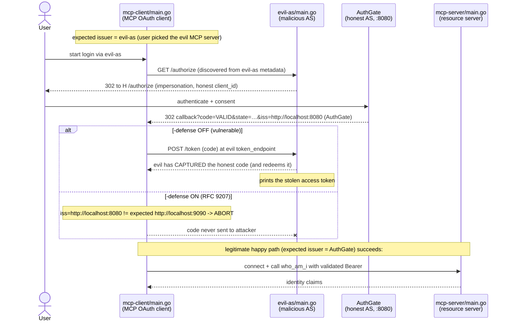

# RFC 9207 Issuer Identification & the MCP Mix-Up Attack

This sample is a **runnable demonstration** of the OAuth 2.0 **authorization
server mix-up attack** and how **RFC 9207 issuer identification** (the `iss`
authorization-response parameter) defends against it — in the specific setting
MCP creates: a single MCP client that trusts **multiple** authorization
servers, one per MCP server it connects to.

It mirrors the blog post
[RFC 9207 Issuer Identification 與 MCP Mix-Up 攻擊](https://blog.wu-boy.com/2026/07/rfc9207-issuer-identification-mcp-mixup-zh-tw/).

## Why MCP makes this attack easy

In a classic single-provider web app the client talks to exactly one
authorization server, so "which AS issued this code?" is never a real question.
MCP breaks that assumption: one MCP client discovers and trusts a **different**
authorization server for every MCP server it connects to. Once a client holds
credentials for several ASes at once, a malicious AS can impersonate an honest
one and trick the client into delivering an honest server's authorization code
to the attacker. That is the **mix-up attack**, and RFC 9207 is its purpose-built
defense.

## The three actors

| Binary                | Role                                                                        | Default addr |
| --------------------- | --------------------------------------------------------------------------- | ------------ |
| `mcp-client/main.go`  | MCP OAuth client — hand-rolled Auth Code + PKCE, optional RFC 9207 check    | callback `:8085` |
| `evil-as/main.go`     | Malicious authorization server the client is tricked into trusting          | `:9090`      |
| `mcp-server/main.go`  | Honest MCP resource server, one Bearer-protected `who_am_i` tool            | `:8095`      |

The **honest** authorization server is an external
[AuthGate](https://github.com/go-authgate/authgate) instance (default
`http://localhost:8080`), exactly as the sibling `dcr/` and
`client-credentials/` examples already assume.

## Attack and defense at a glance



## The teaching point: the SDK does not do RFC 9207 for you

go-sdk `v1.6.1`'s `auth.AuthorizationResult` exposes only `Code` and `State` —
**there is no `Iss` field, and the SDK does not validate the RFC 9207 `iss`
parameter.** Likewise `oauthex.AuthServerMeta` does not surface the
`authorization_response_iss_parameter_supported` metadata flag.

So, exactly like the neighboring `dcr/oauth-client` hand-rolls its PKCE flow
(the SDK lacks an extension point for `resource=`), this sample **hand-rolls the
`iss` validation** in the client:

- it reads the `iss` query parameter off the callback itself, and
- it fetches `authorization_response_iss_parameter_supported` from the AS
  metadata document directly (`fetchIssParameterSupported`).

That gap _is_ the lesson: **RFC 9207 support is a client responsibility today,
not something the SDK grants for free.** The whole check lives in one function:

```go
// mcp-client/main.go
func validateIssuerResponse(iss, expectedIssuer string, issParameterSupported bool) error {
	if issParameterSupported {
		if iss == "" {
			return fmt.Errorf(
				"issuer identification required but authorization response carried no iss "+
					"(expected %q)", expectedIssuer)
		}
		if iss != expectedIssuer { // byte-for-byte, RFC 9207 §2.4
			return fmt.Errorf(
				"issuer mismatch: got %q want %q — aborting", iss, expectedIssuer)
		}
		return nil
	}
	// The AS does not advertise RFC 9207 support. A conforming AS then must not
	// send iss; if one appears, the response is not trustworthy.
	if iss != "" {
		return fmt.Errorf(
			"authorization response carried iss %q but the AS does not advertise "+
				"issuer identification support — aborting", iss)
	}
	return nil
}
```

`-defense` toggles whether the client runs this check before it sends the code
to any token endpoint.

## Quick start

You need a running AuthGate (honest AS) at `http://localhost:8080` and a client
registered there whose redirect URI is `http://127.0.0.1:8085/callback`. See
[TESTING.md](TESTING.md) for the full step-by-step runbook of all three
scenarios; the short version:

```bash
# terminal 1 — honest MCP resource server
go run ./03-oauth-mcp/issuer-identification/mcp-server \
  -auth-server http://localhost:8080 \
  -resource    http://localhost:8095/mcp

# terminal 2 — malicious authorization server
go run ./03-oauth-mcp/issuer-identification/evil-as \
  -issuer    http://localhost:9090 \
  -honest-as http://localhost:8080

# terminal 3, scenario 1 — honest happy path (defense on, reaches who_am_i)
go run ./03-oauth-mcp/issuer-identification/mcp-client \
  -auth-server http://localhost:8080 \
  -mcp-url     http://localhost:8095/mcp \
  -client_id   <your-registered-client-id> -defense

# terminal 3, scenario 2 — mix-up with defense OFF (evil-as captures the code)
go run ./03-oauth-mcp/issuer-identification/mcp-client \
  -auth-server http://localhost:9090 \
  -mcp-url     http://localhost:8095/mcp \
  -client_id   <your-registered-client-id>

# terminal 3, scenario 3 — mix-up with defense ON (client aborts on iss mismatch)
go run ./03-oauth-mcp/issuer-identification/mcp-client \
  -auth-server http://localhost:9090 \
  -mcp-url     http://localhost:8095/mcp \
  -client_id   <your-registered-client-id> -defense
```

## What to watch in the logs

- **Scenario 1:** client logs `iss OK — issuer matches the discovered
  authorization server`, then a successful `who_am_i` tool result.
- **Scenario 2:** `evil-as` logs `CAPTURED authorization code at evil-as /token
  endpoint` and (with `-redeem`, the default) `STOLEN ACCESS TOKEN minted from
  captured code`.
- **Scenario 3:** client logs `issuer mismatch: got "…8080" want "…9090" —
  aborting` and never calls `evil-as /token`; `evil-as` captures nothing.

## Tests

```bash
go test ./03-oauth-mcp/issuer-identification/...
```

`mcp-client/issuer_test.go` is a table-driven unit test of `validateIssuerResponse`
covering all four RFC 9207 branches (supported+match, supported+missing,
supported+mismatch, unsupported+present) plus the legacy unsupported+absent case.

## References

- Blog post: <https://blog.wu-boy.com/2026/07/rfc9207-issuer-identification-mcp-mixup-zh-tw/>
- [RFC 9207 — OAuth 2.0 Authorization Server Issuer Identification](https://datatracker.ietf.org/doc/html/rfc9207)
- [RFC 8707 — Resource Indicators for OAuth 2.0](https://datatracker.ietf.org/doc/html/rfc8707)
- [RFC 9728 — OAuth 2.0 Protected Resource Metadata](https://datatracker.ietf.org/doc/html/rfc9728)
- [RFC 8414 — OAuth 2.0 Authorization Server Metadata](https://datatracker.ietf.org/doc/html/rfc8414)
