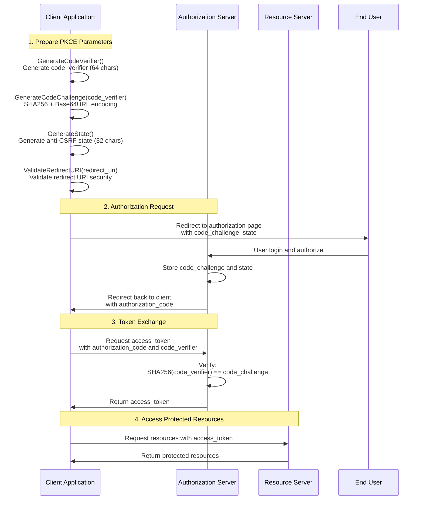
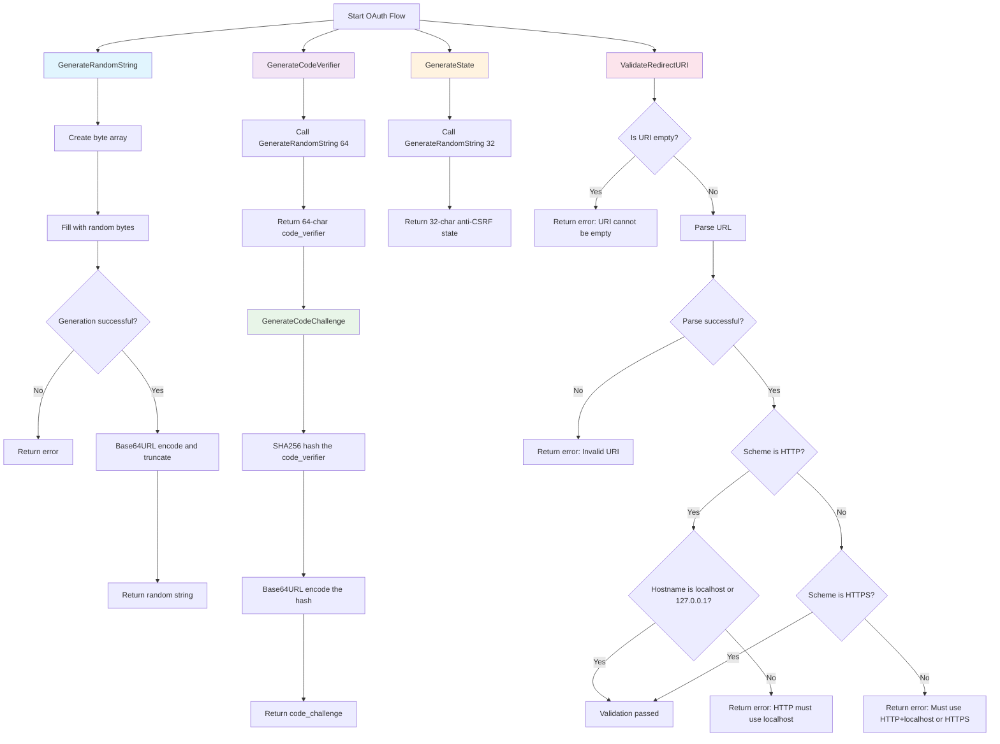

# OAuth MCP Client

This application demonstrates an OAuth 2.0 client that integrates with the MCP OAuth server using GitHub as the OAuth provider. It performs the OAuth Authorization Code flow with PKCE, handles dynamic client registration, and showcases MCP tool interaction with authenticated requests.

---

## Features

- **Full OAuth 2.0 Authorization Code Flow with PKCE:**
  - Launches your browser for GitHub OAuth authentication
  - Hosts a local server on port 8085 to receive the OAuth callback
  - Generates secure PKCE code verifier and challenge
  - Handles state parameter for CSRF protection
- **Dynamic Client Registration:** Automatically registers with the MCP server if client credentials aren't provided
- **Token Management:** Uses in-memory token store with the mark3labs/mcp-go client library
- **MCP Protocol Integration:** Full MCP client with tool discovery and execution capabilities
- **Cross-Platform Browser Support:** Opens the default browser on Linux, Windows, and macOS

---

## OAuth Client Flow



### High-Level MCP Client Flow

```mermaid
flowchart LR
    Start("Start") --> CreateClient["Create OAuth MCP Client"]
    CreateClient --> StartClient["Start Client"]
    StartClient --> Initialize["Initialize MCP Connection"]
    Initialize --"OAuth Authorization Required"--> RegisterClient["Register Dynamic Client"]
    RegisterClient --> GeneratePKCE["Generate PKCE & State"]
    GeneratePKCE --> LaunchBrowser["Launch Browser to GitHub"]
    LaunchBrowser --> CallbackServer["Local Server Receives Code"]
    CallbackServer --> VerifyState["Verify State Parameter"]
    VerifyState --> ExchangeToken["Exchange Code for Token"]
    ExchangeToken --> PingServer["Ping Server"]
    PingServer --> ReInitialize["Re-initialize with Token"]
    ReInitialize --> ListTools["List Available Tools"]
    ListTools --> CallTool["Call show_auth_token Tool"]
    Initialize --"No OAuth Required"--> ListTools
```



---

## PKCE Implementation Details

The OAuth implementation uses PKCE (Proof Key for Code Exchange) for enhanced security. Here's how the cryptographic functions work:



### PKCE Security Benefits

- **Code Verifier**: 64-character random string kept secret by the client
- **Code Challenge**: SHA256 hash of code verifier, sent to authorization server
- **State Parameter**: 32-character random string to prevent CSRF attacks
- **URI Validation**: Ensures redirect URIs use localhost HTTP or any HTTPS
- **Protection**: Prevents authorization code interception attacks

---

## Detailed Implementation Flow

1. **Client Setup**
   - Creates `NewOAuthStreamableHttpClient` with server URL `http://localhost:8080/mcp`
   - Configures OAuth with redirect URI `http://localhost:8085/oauth/callback`
   - Sets scopes: `["mcp.read", "mcp.write"]` and enables PKCE
   - Uses memory token store for session management

2. **MCP Initialization Attempt**
   - Attempts to initialize MCP connection with protocol version and client info
   - If OAuth is required, catches `OAuthAuthorizationRequiredError`

3. **OAuth Authorization Flow** (when required)
   - Starts local HTTP server on port 8085 for OAuth callback
   - Registers dynamic client with name "mcp-go-oauth-example"
   - Generates cryptographically secure PKCE code verifier (64 chars)
   - Creates SHA256 code challenge from verifier
   - Generates random state parameter (32 chars) for CSRF protection
   - Opens browser to GitHub authorization URL with all parameters

4. **Callback Handling**
   - Local server receives authorization code and state from GitHub
   - Verifies state parameter matches to prevent CSRF attacks
   - Exchanges authorization code for access token using PKCE verifier

5. **Authenticated Operations**
   - Pings server to verify connection with new token
   - Re-initializes MCP client with authenticated session
   - Lists available tools from the server
   - Demonstrates tool execution with `show_auth_token` tool

---

## Getting Started

### Prerequisites

1. **Start the OAuth MCP Server** (required first):

   ```bash
   cd 03-oauth-mcp/server
   go run server.go -client_id="your-github-client-id" -client_secret="your-github-client-secret"
   ```

2. **GitHub OAuth App Setup:**
   - Create a GitHub OAuth App in your GitHub settings
   - Set Authorization callback URL to `http://localhost:8085/oauth/callback`
   - Note your Client ID and Client Secret for the server

### Running the Client

1. Change to the client directory:

   ```bash
   cd 03-oauth-mcp/client
   ```

2. (Optional) Set environment variables for pre-configured client credentials:

   ```bash
   export MCP_CLIENT_ID="your-client-id"
   export MCP_CLIENT_SECRET="your-client-secret"
   ```

3. Start the client:

   ```bash
   go run client.go
   ```

### What Happens

1. Client attempts to connect to MCP server at `http://localhost:8080/mcp`
2. Server responds with OAuth authorization required
3. Client automatically opens your browser to GitHub OAuth page
4. After you authorize, GitHub redirects to the local callback server
5. Client exchanges the code for an access token
6. Client reconnects to MCP server with the token
7. Available tools are listed and the `show_auth_token` tool is demonstrated

---

## Code Structure

### Key Components

- **`NewOAuthStreamableHttpClient`**: Creates MCP client with OAuth support
- **`client.NewMemoryTokenStore()`**: In-memory token persistence
- **`IsOAuthAuthorizationRequiredError()`**: Detects when OAuth is needed
- **`startCallbackServer()`**: Local HTTP server for OAuth callback on port 8085
- **`openBrowser()`**: Cross-platform browser launching utility

### Available Tools

The server provides these MCP tools:

- **`show_auth_token`**: Displays masked authorization token from context
- **`make_authenticated_request`**: Makes authenticated request to external API

### Error Handling

- **Fatal errors**: Logged with slog and exit with status 1
- **State verification**: Prevents CSRF attacks by verifying state parameter
- **Token validation**: Ensures valid access token before MCP operations

## References

- [MCP Documentation](https://mark3.ai/docs/mcp/)
- [OAuth 2.0 RFC6749](https://datatracker.ietf.org/doc/html/rfc6749)
- [mark3labs/mcp-go Client Library](https://github.com/mark3labs/mcp-go)
- [Client Source Code](client.go)
