# MCP Proxy

## Introduction

[**MCP Proxy**](https://github.com/TBXark/mcp-proxy) is a server that **aggregates multiple MCP resource servers** behind a single HTTP endpoint. It helps clients access all tools and data streams from various MCP servers through one simple connection.

---

## Why Use MCP Proxy?

Connecting directly to several MCP resource servers can quickly become **complex, difficult to manage, and insecure** as systems grow. MCP Proxy acts as a single bridge or entry point, so clients only need to connect once to reach all the backend resources.

---

## Features

- **Unified Access:** Connect to many MCP resource servers (stdio, SSE, or HTTP) through just one proxy.
- **Live Data Streaming:** Supports real-time updates with Server-Sent Events (SSE) or HTTP streaming.
- **Flexible Configuration:** Easily add, remove, or reconfigure backend servers without changing client code.
- **Simplified Deployment & Security:** Only the proxy is exposed to clients. All resource servers remain safely hidden.

---

## Architecture

The following diagram illustrates how the MCP Proxy serves as a bridge between clients and multiple MCP resource servers:

```mermaid
graph TD
    %% Client Layer
    subgraph Clients["🖥️ Client Layer"]
        Claude["Claude Desktop"]
        API["API Client"]
        Other["Other MCP Clients"]
    end

    %% MCP Proxy Core
    subgraph Proxy["🔄 MCP Proxy Server"]
        HTTP["HTTP Server<br/>Listen: {addr}<br/>Base URL: {baseURL}"]

        subgraph Core["Core Components"]
            Aggregator["Tool Aggregator<br/>Aggregates Multiple Resource Servers"]
            Config["Config Management<br/>• JSON Config<br/>• Tool Filtering (allow/block)<br/>• Auth Token Management"]
            ConnMgr["Connection Manager<br/>• stdio Transport<br/>• Streamable HTTP Transport"]
            Router["Router"]
        end
    end

    %% MCP Resource Server Layer
    subgraph Servers["⚙️ MCP Resource Servers"]
        subgraph StdIO["stdio Servers"]
            StdIOCmd["CLI Tools<br/>Subprocess Execution<br/>npx, uvx Supported"]
        end


        subgraph HTTPStream["HTTP Streaming Servers"]
            HTTPUrl["streamable-http<br/>URL + Timeout Config<br/>Custom Headers"]
        end

        subgraph Tools["Tools & Capabilities"]
            FileOp["File Operations"]
            APICall["API Calls"]
            DBQuery["Database Queries"]
            Custom["Custom Tools"]
        end
    end

    %% Connections

    HTTP --> Router
    Router --> Aggregator

    Config -.-> ConnMgr
    ConnMgr --> StdIOCmd
    ConnMgr --> SSEUrl
    ConnMgr --> HTTPUrl

    Aggregator --> Tools

    %% Authentication Flow
    HTTP -->|Validate Auth Tokens| Config

    %% Response Flow
    StdIOCmd -.->|Tool Response| Aggregator
    SSEUrl -.->|Tool Response| Aggregator
    HTTPUrl -.->|Tool Response| Aggregator

    Aggregator -.->|Aggregated Response| SSE
    SSE -.->|Unified Response| HTTP
    HTTP -.->|JSON Response| Clients

    %% Config File
    ConfigFile["📄 config.json<br/>• Server Configs<br/>• Transport Types<br/>• Tool Filtering Rules<br/>• Auth Tokens"]
    ConfigFile -.-> Config

    %% Docker Deployment
    Docker["🐳 Docker Container<br/>ghcr.io/tbxark/mcp-proxy<br/>Supports npx, uvx"]
    Docker -.-> Proxy

    %% Styles
    classDef clientClass fill:#2196F3,stroke:#1976D2,stroke-width:2px,color:white
    classDef proxyClass fill:#4CAF50,stroke:#45a049,stroke-width:2px,color:white
    classDef serverClass fill:#FF9800,stroke:#F57C00,stroke-width:2px,color:white
    classDef configClass fill:#9C27B0,stroke:#7B1FA2,stroke-width:2px,color:white
    classDef dockerClass fill:#00BCD4,stroke:#0097A7,stroke-width:2px,color:white

    class Claude,API,Other clientClass
    class HTTP,SSE,Aggregator,Config,ConnMgr,Router proxyClass
    class StdIOCmd,SSEUrl,HTTPUrl,FileOp,APICall,DBQuery,Custom serverClass
    class ConfigFile configClass
    class Docker dockerClass
```

_Clients only connect to the MCP Proxy, which forwards requests and collects data from all backend MCP Resource Servers._

---

## How It Works

1. **Client establishes a single connection** to MCP Proxy (using HTTP or SSE).
2. **MCP Proxy connects to multiple MCP resource servers** (stdio, SSE, or HTTP).
3. **Proxy aggregates all server responses** and streams tools, tasks, logs, or events back to the client in real time.
4. **Backend servers remain hidden**, improving security and manageability.

---

## Example Use Cases

- **Centralized AI Agent Control:** Manage and monitor AI agents running on multiple backends through a single web client.
- **Observability & Monitoring:** Collect logs or metrics from distributed MCP servers in one real-time dashboard.
- **Multi-domain Integration:** Orchestrate workflows or services that cross physical or network boundaries, without requiring clients to directly access each backend.

---

## Getting Started

> Coming soon: Configuration and setup instructions for running your own MCP Proxy server.

---

## Summary

MCP Proxy helps you **integrate, scale, and secure** access to your distributed MCP resource servers, combining their capabilities into one easy-to-use, real-time interface.
