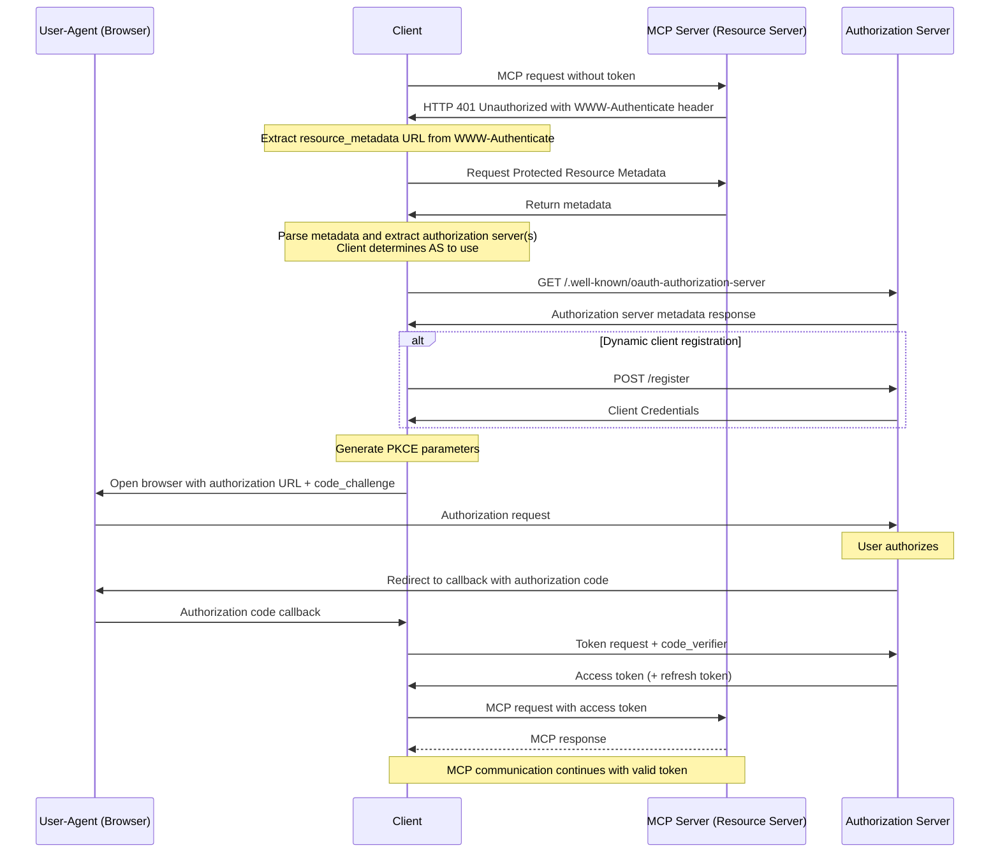

# mcp-workshop

[](https://github.com/go-training/mcp-workshop/actions/workflows/ci.yml)

English | [繁體中文](README.zh-TW.md) | [簡體中文](README.zh-CN.md)


This workshop provides a comprehensive guide to building MCP ([Model Context Protocol][1]) servers and clients using the [Go programming language][2]. You will learn how to leverage MCP to streamline your workflow and enhance your development environment.

📖 [Slides: Building MCP (Model Context Protocol) with Golang](https://speakerdeck.com/appleboy/building-mcp-model-context-protocol-with-golang)

## Table of Contents

- [mcp-workshop](#mcp-workshop)
  - [Table of Contents](#table-of-contents)
  - [Workshop Modules](#workshop-modules)
    - [Modules Overview](#modules-overview)
  - [VS Code MCP Configuration](#vs-code-mcp-configuration)
    - [Structure](#structure)
      - [Example (`.vscode/mcp.json`)](#example-vscodemcpjson)
    - [Usage](#usage)
  - [MCP Inspector Tool](#mcp-inspector-tool)
  - [OAuth Protocol in MCP](#oauth-protocol-in-mcp)
  - [MCP Vulnerabilities](#mcp-vulnerabilities)
  - [Reference Links](#reference-links)


📖 [Slides: Building MCP (Model Context Protocol) with Golang](https://speakerdeck.com/appleboy/building-mcp-model-context-protocol-with-golang)

## Workshop Modules

This workshop consists of hands-on modules, each demonstrating a key aspect of building MCP (Model Context Protocol) servers and related infrastructure in Go.

### Modules Overview

- **[01. Basic MCP Server](01-basic-mcp/):**
  - Minimal MCP server supporting both stdio and HTTP, using Gin. Shows server setup, tool registration, and logging/error handling best practices.
  - _Key features:_ Dual transport (stdio/HTTP), Gin integration, extensible tool registration.
- **[02. Basic Token Passthrough](02-basic-token-passthrough/):**
  - Transparent authentication token passthrough for HTTP and stdio. Demonstrates context injection and tool development for authenticated requests.
  - _Key features:_ Token passthrough, context injection, example authenticated tools.
- **[03. OAuth MCP Server](03-oauth-mcp/):**
  - MCP server with OAuth 2.0 protection. Example endpoints for auth, tokens, resource metadata; context-based token handling and authenticated API usage.
  - _Key features:_ OAuth 2.0 flow, protected endpoints, context-based token propagation, demo tools.
- **[04. Observability](04-observability/):**
  - Observability and tracing for MCP servers using OpenTelemetry and structured logging. Includes metrics, detailed traces, and error reporting.
  - _Key features:_ Tracing, structured logging, observability middleware, error reporting.
- **[05. MCP Proxy](05-mcp-proxy/):**
  - Proxy server that aggregates multiple MCP servers behind one endpoint. Supports live streaming and centralizes configuration/security.
  - _Key features:_ Unified access, SSE/HTTP streaming, flexible config, improved security.

Refer to each module’s directory and `README.md` for detailed instructions and code examples

## VS Code MCP Configuration

The `.vscode/mcp.json` file configures MCP-related development in VS Code, allowing you to register servers and store required credentials (such as API keys) in a single place. This enables easy integration and switching between different MCP endpoints and credential sets.

### Structure

- **inputs**: Prompt the user for required values (e.g., API keys) when the workspace is opened.
  - Example: `perplexity-key` – stores your Perplexity API Key as a password input.
- **servers**: Define named MCP server connections, including protocol, endpoint, and optional headers.
  - Examples:
    - `default-stdio-server`: Connects to a local MCP server using stdio via `mcp-server`.
    - `default-http-server`: Connects to a remote MCP server over HTTP, using an authorization header.
    - `default-oauth-server`, `proxy-server-01`, `proxy-server-02`: Additional HTTP(S) endpoints, with or without headers.

#### Example (`.vscode/mcp.json`)

```json
{
  "inputs": [
    {
      "type": "promptString",
      "id": "perplexity-key",
      "description": "Perplexity API Key",
      "password": true
    }
  ],
  "servers": {
    "default-stdio-server": {
      "type": "stdio",
      "command": "mcp-server",
      "args": ["-t", "stdio"]
    },
    "default-http-server": {
      "type": "http",
      "url": "http://localhost:8080/mcp",
      "headers": {
        "Authorization": "Bearer 1234567890"
      }
    }
    // ... more server entries ...
  }
}
```

### Usage

1. Place `.vscode/mcp.json` in the root or `.vscode/` directory of your workspace.
2. Add/modify `inputs` for required user secrets.
3. Configure `servers` with endpoints for each service you want to register (specify type, command, URL, and headers as needed).
4. On opening the workspace, VS Code and supported MCP tools will prompt for the required inputs and use the server connections for MCP operations.

For further customization or advanced usage, edit the file to add endpoints or credentials. Centralized configuration streamlines connection management and development.

[1]: https://modelcontextprotocol.io/introduction
[2]: https://go.dev

## MCP Inspector Tool

[The MCP Inspector][01] is a developer tool (similar to Postman) for testing and debugging MCP servers. Use it to send requests and view responses from MCP endpoints—ideal for streamlining development and troubleshooting.


[01]: https://github.com/modelcontextprotocol/inspector

## OAuth Protocol in MCP

The following diagrams illustrate the OAuth flow within MCP, detailing the sequence of communication between roles.


_Sequence diagram showing communication with each role separately:_


For more information:

- [Let's fix OAuth in MCP][3]
- [MCP Authorization][4]

[3]: https://aaronparecki.com/2025/04/03/15/oauth-for-model-context-protocol
[4]: https://modelcontextprotocol.io/specification/2025-03-26/basic/authorization

The full OAuth access token flow is depicted in the [MCP Specification](https://modelcontextprotocol.io/specification/draft/basic/authorization#authorization-flow-steps). A simplified sequence:



> **Note:** Dynamic Client Registration is NOT supported by Remote MCP Server at this time.

## MCP Vulnerabilities

Some known vulnerabilities in MCP implementations:


- **Command Injection** (Impact: Moderate 🟡)
- **Tool Poisoning** (Impact: Severe 🔴)
- **Open Connections via SSE** (Impact: Moderate 🟠)
- **Privilege Escalation** (Impact: Severe 🔴)
- **Persistent Context Misuse** (Impact: Low, but risky 🟡)
- **Server Data Takeover/Spoofing** (Impact: Severe 🔴)

For more information, see [MCP Vulnerabilities][11].

[11]: https://www.linkedin.com/posts/eordax_ai-mcp-genai-activity-7333057511651954688-sbNO

## Reference Links

- [An Introduction to MCP and Authorization](https://auth0.com/blog/an-introduction-to-mcp-and-authorization/)
- [Auth0 for MCP Servers](https://auth0.com/ai/docs/mcp/auth-for-mcp)
- [Understanding OAuth2 and implementing identity-aware MCP servers](https://heeki.medium.com/understanding-oauth2-and-implementing-identity-aware-mcp-servers-221a06b1a6cf)
- [Enterprise-Ready MCP](https://aaronparecki.com/2025/05/12/27/enterprise-ready-mcp)
- [[Session] Intro to OAuth for MCP Servers with Aaron Parecki, Okta](https://www.youtube.com/watch?v=mYKMwZcGynw)
