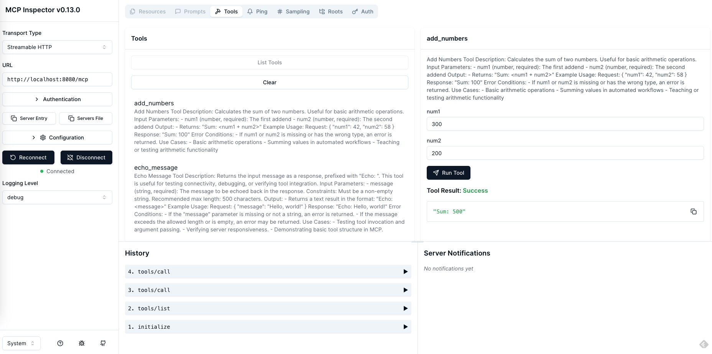
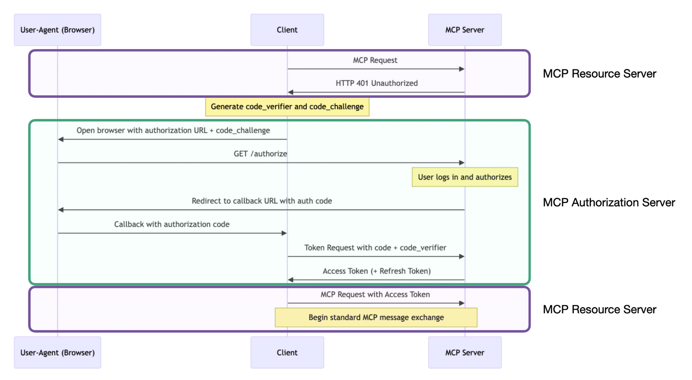
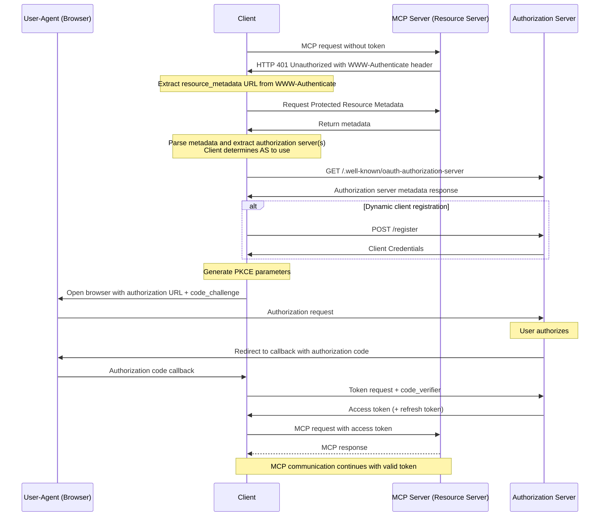

# mcp-workshop

English | [繁體中文](README.zh-TW.md) | [簡體中文](README.zh-CN.md)

This workshop provides a comprehensive guide to building both MCP ([Model Context Protocol][1]) servers and clients using the [Go programming language][2]. You will learn how to leverage MCP to streamline your workflow and enhance your development environment.

## Table of Contents

- [mcp-workshop](#mcp-workshop)
  - [Table of Contents](#table-of-contents)
  - [Workshop Modules Overview](#workshop-modules-overview)
    - [01. Basic MCP Server (`01-basic-mcp`)](#01-basic-mcp-server-01-basic-mcp)
    - [02. Basic Token Passthrough (`02-basic-token-passthrough`)](#02-basic-token-passthrough-02-basic-token-passthrough)
    - [03. OAuth MCP Server (`03-oauth-mcp`)](#03-oauth-mcp-server-03-oauth-mcp)
    - [04. Observability (`04-observability`)](#04-observability-04-observability)
    - [05. MCP Proxy (`05-mcp-proxy`)](#05-mcp-proxy-05-mcp-proxy)
  - [Using .vscode/mcp.json](#using-vscodemcpjson)
    - [Structure](#structure)
      - [Example (`.vscode/mcp.json`)](#example-vscodemcpjson)
    - [Usage](#usage)
  - [MCP Inspector](#mcp-inspector)
  - [OAuth in MCP](#oauth-in-mcp)
  - [MCP Vulnerabilities](#mcp-vulnerabilities)


📖 [Slides: Building MCP (Model Context Protocol) with Golang](https://speakerdeck.com/appleboy/building-mcp-model-context-protocol-with-golang)

## Workshop Modules Overview

This workshop is organized into a series of hands-on modules, each demonstrating a key aspect of building MCP (Model Context Protocol) servers and related infrastructure in Go. Below is a summary of each module:

### 01. Basic MCP Server ([`01-basic-mcp`](01-basic-mcp/))

A minimal MCP server implementation supporting both stdio and HTTP transports, using the Gin web framework. Demonstrates server setup, tool registration, and best practices for logging and error handling.

- **Key features:** Dual transport (stdio/HTTP), Gin integration, extensible tool registration.

### 02. Basic Token Passthrough ([`02-basic-token-passthrough`](02-basic-token-passthrough/))

Shows how to transparently pass authentication tokens through the context, supporting both HTTP and stdio transports. Tokens are extracted from HTTP headers or environment variables and made available to downstream tools.

- **Key features:** Token passthrough, context injection, example tools for authenticated requests.

### 03. OAuth MCP Server ([`03-oauth-mcp`](03-oauth-mcp/))

Demonstrates an MCP server protected by OAuth 2.0, including endpoints for authorization, token exchange, and resource metadata. Integrates token handling via context and provides sample tools for authenticated API calls.

- **Key features:** OAuth 2.0 flow, protected endpoints, context-based token propagation, example tools.

### 04. Observability ([`04-observability`](04-observability/))

Focuses on observability and tracing in MCP servers. Integrates OpenTelemetry and structured logging to provide detailed traces, metrics, and error reporting for tool invocations and server operations.

- **Key features:** OpenTelemetry tracing, structured logging, observability middleware, error reporting.

### 05. MCP Proxy ([`05-mcp-proxy`](05-mcp-proxy/))

A proxy server that aggregates multiple MCP resource servers behind a single HTTP endpoint. Simplifies client access, supports live data streaming, and centralizes configuration and security.

- **Key features:** Unified access to multiple MCP servers, live streaming (SSE/HTTP), flexible configuration, improved security.

Refer to each module's directory and `README.md` for detailed instructions and code examples.

## Using .vscode/mcp.json

The `.vscode/mcp.json` file provides configuration for MCP-related development within VS Code, allowing you to register servers and supply required credentials (such as API keys) in a unified place. This file enables easy integration and switching between different MCP server endpoints and credential sets.

### Structure

- **inputs**: Prompts the user for required values, such as API keys, when a workspace is opened. For example:

  - `perplexity-key` – Stores your Perplexity API Key securely as a password input.

- **servers**: Defines known MCP server connections (by name), including protocol, endpoint, and headers if necessary. Examples in the default file:

  - `default-stdio-server` – Connects to a local MCP server via stdio using the `mcp-server` command.
  - `default-http-server` – Connects to a remote MCP server over HTTP, passing an authorization header as required.
  - `default-oauth-server`, `proxy-server-01`, `proxy-server-02` – Additional HTTP(S) servers, with or without custom headers and endpoints.

#### Example (`.vscode/mcp.json`)

```json
{
  "inputs": [
    {
      "type": "promptString",
      "id": "perplexity-key",
      "description": "Perplexity API Key",
      "password": true
    }
  ],
  "servers": {
    "default-stdio-server": {
      "type": "stdio",
      "command": "mcp-server",
      "args": ["-t", "stdio"]
    },
    "default-http-server": {
      "type": "http",
      "url": "http://localhost:8080/mcp",
      "headers": {
        "Authorization": "Bearer 1234567890"
      }
    }
    // ... more server entries ...
  }
}
```

### Usage

1. Place your `.vscode/mcp.json` in the root or `.vscode/` directory of your workspace.
2. Add or modify the `inputs` to include any required user-provided secrets.
3. Configure the `servers` block with relevant endpoints for each service you want to register. You can specify server type (`stdio` or `http`), commands, arguments, URLs, and headers (such as authentication tokens).
4. When opening the workspace, VS Code and supported MCP extensions or tools will prompt for required inputs and use these server connections for MCP operations.

For further customization or advanced scenarios, edit the file to register new endpoints or provide different credentials. This centralized configuration streamlines connection management and enhances development efficiency.

[1]: https://modelcontextprotocol.io/introduction
[2]: https://go.dev

## MCP Inspector

[The MCP Inspector][01] is a developer tool designed for testing and debugging MCP servers. Similar to Postman, it enables you to send requests to MCP servers and view their responses. This tool is invaluable for developers working with MCP, providing a streamlined workflow for server interaction and troubleshooting.



[01]: https://github.com/modelcontextprotocol/inspector

## OAuth in MCP

The following diagrams illustrate the OAuth flow within MCP, including the sequence of communication between each role.



Sequence diagram showing communication with each role separately.


For more information on OAuth in MCP, refer to the [Let's fix OAuth in MCP][3] or the [MCP Authorization][4] documentation.

[3]: https://aaronparecki.com/2025/04/03/15/oauth-for-model-context-protocol
[4]: https://modelcontextprotocol.io/specification/2025-03-26/basic/authorization

The expected flow for obtaining a valid access token via OAuth is depicted in the [MCP Specification](https://modelcontextprotocol.io/specification/draft/basic/authorization#authorization-flow-steps). For convenience, we've embedded a copy of the authorization flow below. Please study it carefully as the remainder of this document is written with this flow in mind.



> [!NOTE]
> Dynamic Client Registration is NOT supported by Remote MCP Server at this time.

## MCP Vulnerabilities

The following are some known vulnerabilities in MCP implementations:


- Command Injection (Impact: Moderate 🟡)
- Tool Poisoning (Impact: Severe 🔴)
- Open Connections via SSE (Impact: Moderate 🟠)
- Privilege Escalation (Impact: Severe 🔴)
- Persistent Context Misuse (Impact: Low, but risky 🟡)
- Server Data Takeover/Spoofing (Impact: Severe 🔴)

For more information, refer to the [MCP Vulnerabilities][11].

[11]: https://www.linkedin.com/posts/eordax_ai-mcp-genai-activity-7333057511651954688-sbNO
