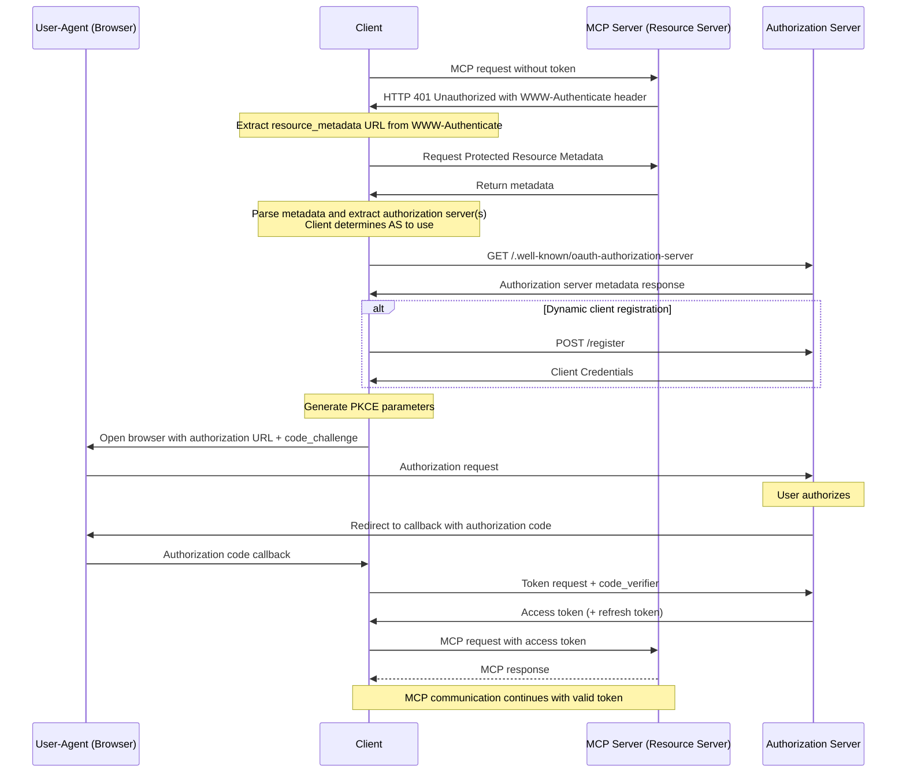

# mcp-workshop

This workshop provides a comprehensive guide to building both MCP ([Model Context Protocol][1]) servers and clients using the [Go programming language][2]. You will learn how to leverage MCP to streamline your workflow and enhance your development environment.

## Table of Contents

- [mcp-workshop](#mcp-workshop)
  - [Table of Contents](#table-of-contents)
  - [MCP Inspector](#mcp-inspector)
  - [OAuth in MCP](#oauth-in-mcp)
  - [MCP Vulnerabilities](#mcp-vulnerabilities)

[1]: https://modelcontextprotocol.io/introduction
[2]: https://go.dev

## MCP Inspector

The MCP Inspector is a developer tool designed for testing and debugging MCP servers. Similar to Postman, it enables you to send requests to MCP servers and view their responses. This tool is invaluable for developers working with MCP, providing a streamlined workflow for server interaction and troubleshooting.

## OAuth in MCP

The following diagrams illustrate the OAuth flow within MCP, including the sequence of communication between each role.

Sequence diagram showing communication with each role separately.

For more information on OAuth in MCP, refer to the [Let's fix OAuth in MCP][3] or the [MCP Authorization][4] documentation.

[3]: https://aaronparecki.com/2025/04/03/15/oauth-for-model-context-protocol
[4]: https://modelcontextprotocol.io/specification/2025-03-26/basic/authorization

The expected flow for obtaining a valid access token via OAuth is depicted in the [MCP Specification](https://modelcontextprotocol.io/specification/draft/basic/authorization#authorization-flow-steps).  For convenience, we've embedded a copy of the authorization flow below.  Please study it carefully as the remainder of this document is written with this flow in mind.

> [!NOTE]
> Dynamic Client Registration is NOT supported by Remote MCP Server at this time.

## MCP Vulnerabilities

The following are some known vulnerabilities in MCP implementations:

- Command Injection (Impact: Moderate 🟡)
- Tool Poisoning (Impact: Severe 🔴)
- Open Connections via SSE (Impact: Moderate 🟠)
- Privilege Escalation (Impact: Severe 🔴)
- Persistent Context Misuse (Impact: Low, but risky 🟡)
- Server Data Takeover/Spoofing (Impact: Severe 🔴)

For more information, refer to the [MCP Vulnerabilities][11].

[11]: https://www.linkedin.com/posts/eordax_ai-mcp-genai-activity-7333057511651954688-sbNO
