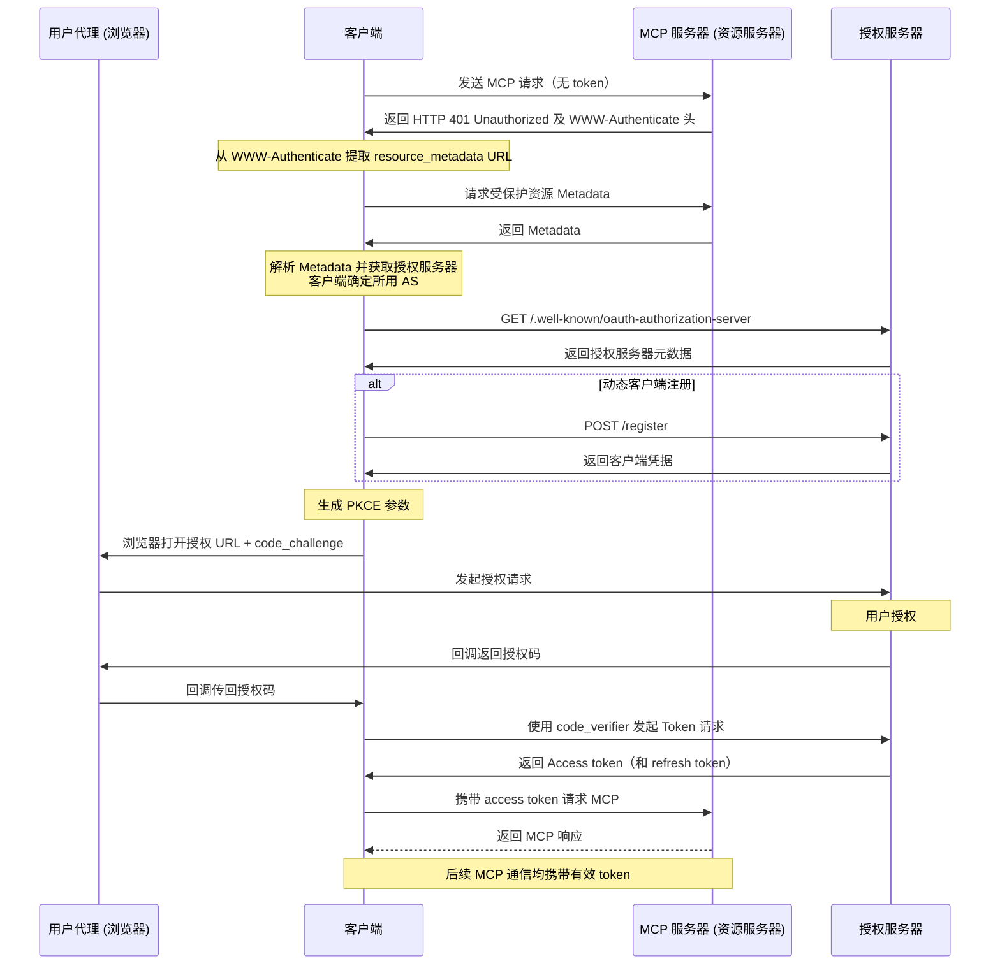

# mcp-workshop

[English](README.md) | [繁體中文](README.zh-TW.md) | 简体中文

本工作坊为您提供使用 [Go 编程语言][2] 构建 MCP（[Model Context Protocol][1]）服务器和客户端的完整指南。您将学习如何利用 MCP 优化开发流程并提升开发环境。

## 目录

- [mcp-workshop](#mcp-workshop)
  - [目录](#目录)
  - [课程模块概览](#课程模块概览)
    - [01. 基础 MCP 服务器（`01-basic-mcp`）](#01-基础-mcp-服务器01-basic-mcp)
    - [02. 基础 Token 透传（`02-basic-token-passthrough`）](#02-基础-token-透传02-basic-token-passthrough)
    - [03. OAuth MCP 服务器（`03-oauth-mcp`）](#03-oauth-mcp-服务器03-oauth-mcp)
    - [04. 可观测性（`04-observability`）](#04-可观测性04-observability)
    - [05. MCP 代理（`05-mcp-proxy`）](#05-mcp-代理05-mcp-proxy)
  - [使用 .vscode/mcp.json](#使用-vscodemcpjson)
    - [结构](#结构)
      - [示例（`.vscode/mcp.json`）](#示例vscodemcpjson)
    - [用法](#用法)
  - [MCP Inspector](#mcp-inspector)
  - [MCP 中的 OAuth](#mcp-中的-oauth)
  - [MCP 漏洞](#mcp-漏洞)


📖 [演示文稿：用 Golang 构建 MCP (Model Context Protocol)](https://speakerdeck.com/appleboy/building-mcp-model-context-protocol-with-golang)

## 课程模块概览

本工作坊采用模块化形式，每个模块演示如何用 Go 构建 MCP（Model Context Protocol）服务器及其配套基础架构。以下是各模块简介：

### 01. 基础 MCP 服务器（[`01-basic-mcp`](01-basic-mcp/)）

实现支持 stdio 和 HTTP 两种传输方式的简易 MCP 服务器，基于 Gin 框架。展示服务器搭建、工具注册、日志与错误处理最佳实践。

- **主要特性：** 双通道（stdio/HTTP）、Gin 集成、可扩展的工具注册。

### 02. 基础 Token 透传（[`02-basic-token-passthrough`](02-basic-token-passthrough/)）

介绍如何透明地将身份验证 Token 通过 context 传递，支持 HTTP 及 stdio 传输。Token 可从 HTTP 头或环境变量获取并供下游工具使用。

- **主要特性：** Token 透传、context 注入、认证请求示例工具。

### 03. OAuth MCP 服务器（[`03-oauth-mcp`](03-oauth-mcp/)）

演示基于 OAuth 2.0 保护的 MCP 服务器，包括授权、Token 交换及资源元数据的端点。支持 context 方式的 Token 处理及带认证的 API 调用工具。

- **主要特性：** OAuth 2.0 流程、受保护端点、Token 透传、认证请求示例。

### 04. 可观测性（[`04-observability`](04-observability/)）

聚焦 MCP 服务器的可观测性与链路追踪。集成 OpenTelemetry 及结构化日志，实现详细追踪、指标与错误报告。

- **主要特性：** OpenTelemetry 链路追踪、结构化日志、可观测中间件、错误上报。

### 05. MCP 代理（[`05-mcp-proxy`](05-mcp-proxy/)）

通过单一 HTTP 端点代理多个 MCP 资源服务器。简化客户端接入、支持实时数据流、统一配置与安全管控。

- **主要特性：** 多 MCP 服务器统一接入、实时数据流（SSE/HTTP）、灵活配置、增强安全性。

详细操作及代码示例请参见各模块对应目录及 `README.md`。

## 使用 .vscode/mcp.json

`.vscode/mcp.json` 文件可在 VS Code 中配置 MCP 相关开发环境，集中管理服务器注册及凭证（如 API 密钥），便于集成和切换 MCP 服务器。

### 结构

- **inputs**：在工作区打开时提示用户输入（如 API 密钥）。例如：

  - `perplexity-key` – 以密码方式安全存储 Perplexity API Key。

- **servers**：定义 MCP 服务器连接（按名称），包括协议、端点和必要 header。默认文件示例：

  - `default-stdio-server` – 通过 stdio 和 `mcp-server` 命令连接本地 MCP 服务器。
  - `default-http-server` – 连接远程 HTTP MCP 服务器，可携带授权 header。
  - `default-oauth-server`、`proxy-server-01`、`proxy-server-02` – 其他 HTTP(S) 服务器，可定制 header 和端点。

#### 示例（`.vscode/mcp.json`）

```json
{
  "inputs": [
    {
      "type": "promptString",
      "id": "perplexity-key",
      "description": "Perplexity API Key",
      "password": true
    }
  ],
  "servers": {
    "default-stdio-server": {
      "type": "stdio",
      "command": "mcp-server",
      "args": ["-t", "stdio"]
    },
    "default-http-server": {
      "type": "http",
      "url": "http://localhost:8080/mcp",
      "headers": {
        "Authorization": "Bearer 1234567890"
      }
    }
    // ... 更多服务器设置 ...
  }
}
```

### 用法

1. 将 `.vscode/mcp.json` 放在项目根目录或 `.vscode/` 目录下。
2. 在 `inputs` 部分添加所需字段以存储密钥等信息。
3. 配置 `servers` 区块，针对各服务指定连接信息（类型、命令、参数、URL、认证 header）。
4. 打开工作区时，VS Code 及支持的 MCP 扩展/工具将自动弹窗提示输入，并使用这些设置进行 MCP 操作。

如需更复杂场景或扩展，请直接编辑该文件，集中管理可极大提升开发效率。

[1]: https://modelcontextprotocol.io/introduction
[2]: https://go.dev

## MCP Inspector

[MCP Inspector][01] 是一款用于测试和调试 MCP 服务器的开发者工具。功能类似 Postman，可发送请求并查看响应，为 MCP 开发提供高效工作流。


[01]: https://github.com/modelcontextprotocol/inspector

## MCP 中的 OAuth

下图展示了 MCP 中 OAuth 的通信步骤及各角色交互流程。


序列图说明了各角色之间的交互。


更多信息见 [Let's fix OAuth in MCP][3] 或 [MCP 授权][4] 文档。

[3]: https://aaronparecki.com/2025/04/03/15/oauth-for-model-context-protocol
[4]: https://modelcontextprotocol.io/specification/2025-03-26/basic/authorization

如何通过 OAuth 获取有效 access token，可参考 [MCP 规范](https://modelcontextprotocol.io/specification/draft/basic/authorization#authorization-flow-steps)。下方嵌入的流程图为参考，后续内容均基于此流程。



> [!注意]
> 当前远程 MCP 服务器不支持动态客户端注册。

## MCP 漏洞

以下为 MCP 常见漏洞：


- 命令注入（影响：中等 🟡）
- 工具污染（影响：严重 🔴）
- 通过 SSE 打开连接（影响：中等 🟠）
- 权限提升（影响：严重 🔴）
- 持久 context 滥用（影响：较低，但有风险 🟡）
- 服务器数据劫持/伪造（影响：严重 🔴）

更多信息请参阅 [MCP 漏洞][11]。

[11]: https://www.linkedin.com/posts/eordax_ai-mcp-genai-activity-7333057511651954688-sbNO
