# mcp-workshop

[English](README.md) | [繁體中文](README.zh-TW.md) | 简体中文


本工作坊为您提供使用 [Go 编程语言][2] 构建 MCP（[Model Context Protocol][1]）服务器和客户端的完整指南。您将学习如何利用 MCP 优化流程并提升开发环境。

📖 [演示文稿：用 Golang 构建 MCP (Model Context Protocol)](https://speakerdeck.com/appleboy/building-mcp-model-context-protocol-with-golang)

## 目录

- [mcp-workshop](#mcp-workshop)
  - [目录](#目录)
  - [课程模块](#课程模块)
    - [模块总览](#模块总览)
  - [VS Code MCP 配置](#vs-code-mcp-配置)
    - [结构](#结构)
      - [示例（`.vscode/mcp.json`）](#示例vscodemcpjson)
    - [用法](#用法)
  - [MCP Inspector 工具](#mcp-inspector-工具)
  - [MCP 中的 OAuth 协议](#mcp-中的-oauth-协议)
  - [MCP 漏洞](#mcp-漏洞)


📖 [演示文稿：用 Golang 构建 MCP (Model Context Protocol)](https://speakerdeck.com/appleboy/building-mcp-model-context-protocol-with-golang)

## 课程模块

本工作坊包含多个实践模块，依次演示如何用 Go 构建 MCP（Model Context Protocol）服务器及相关基础设施。

### 模块总览

- **[01. 基础 MCP 服务器](01-basic-mcp/):**
  - 实现同时支持 stdio 和 HTTP 的精简版 MCP 服务器，基于 Gin 框架。涵盖服务器搭建、工具注册与日志/错误处理最佳实践。
  - *主要特性：* 双通道(stdio/HTTP)、Gin 集成、可扩展工具注册
- **[02. 基础 Token 透传](02-basic-token-passthrough/):**
  - 支持 HTTP 与 stdio 的认证 Token 透明透传，演示 context 注入以及开发带认证的工具。
  - *主要特性：* Token 透传、context 注入、认证工具示例
- **[03. OAuth MCP 服务器](03-oauth-mcp/):**
  - 演示使用 OAuth 2.0 保护的 MCP 服务器，包括认证、Token 与资源元数据端点，context 方式处理 Token 及带认证的 API 工具。
  - *主要特性：* OAuth 2.0 流程、受保护端点、Token 透传、演示工具
- **[04. 可观测性](04-observability/):**
  - MCP 服务器的可观测性与追踪，集成 OpenTelemetry 及结构化日志，包含指标、详细追踪与错误上报。
  - *主要特性：* 追踪、结构化日志、可观测中间件、错误报告
- **[05. MCP 代理](05-mcp-proxy/):**
  - 代理多个 MCP 服务器至单一端点。支持直播流和集中配置、安全管控。
  - *主要特性：* 统一接入、SSE/HTTP 流、灵活配置、增强安全性

请参考各模块目录及 `README.md` 获取详细说明与示例

## VS Code MCP 配置

`.vscode/mcp.json` 用于在 VS Code 配置 MCP 相关开发环境，实现服务器注册与凭证（API 密钥等）集中管理，方便集成、切换端点和凭据。

### 结构

- **inputs**: 打开工作空间时提示输入必需值（如 API 密钥）。
  - 例如：`perplexity-key` – 以密码模式安全保存 Perplexity API Key。
- **servers**: 定义 MCP 服务器连接，包括协议、端点和可选头部。
  - 例如：
    - `default-stdio-server`: 使用 stdio 通过 `mcp-server` 连接本地 MCP 服务器
    - `default-http-server`: HTTP 远程 MCP 服务器，包含授权 header
    - `default-oauth-server`、`proxy-server-01`、`proxy-server-02`: 其他 HTTP(S) 端点，可自定义 header

#### 示例（`.vscode/mcp.json`）

```json
{
  "inputs": [
    {
      "type": "promptString",
      "id": "perplexity-key",
      "description": "Perplexity API Key",
      "password": true
    }
  ],
  "servers": {
    "default-stdio-server": {
      "type": "stdio",
      "command": "mcp-server",
      "args": ["-t", "stdio"]
    },
    "default-http-server": {
      "type": "http",
      "url": "http://localhost:8080/mcp",
      "headers": {
        "Authorization": "Bearer 1234567890"
      }
    }
    // ... 更多服务器设置 ...
  }
}
```

### 用法

1. 将 `.vscode/mcp.json` 放在项目根目录或 `.vscode/` 目录下
2. 在 `inputs` 配置中添加必需的密钥提示
3. 配置 `servers`，为每个服务完善端点、类型、命令、头部等信息
4. 打开工作区时，VS Code 及兼容 MCP 工具会自动弹窗提示并应用连接

如需个性化或高级配置，可直接编辑添加端点或凭证。统一配置可大幅提升连接与开发效率。

[1]: https://modelcontextprotocol.io/introduction
[2]: https://go.dev

## MCP Inspector 工具

[MCP Inspector][01] 是一款专为 MCP 服务器测试和调试设计的开发工具，类似 Postman。可发送请求并查看响应，方便开发和排查问题。


[01]: https://github.com/modelcontextprotocol/inspector

## MCP 中的 OAuth 协议

下图说明 MCP 内部 OAuth 流程及各角色通信顺序。


*下方序列图展示各角色间交互：*


更多资料见：

- [Let's fix OAuth in MCP][3]
- [MCP 授权][4]

[3]: https://aaronparecki.com/2025/04/03/15/oauth-for-model-context-protocol
[4]: https://modelcontextprotocol.io/specification/2025-03-26/basic/authorization

完整 OAuth token 流程详见 [MCP 规范](https://modelcontextprotocol.io/specification/draft/basic/authorization#authorization-flow-steps)。简化版如下：

```mermaid
sequenceDiagram
    participant B as 用户代理（浏览器）
    participant C as 客户端
    participant M as MCP 服务器（资源服务器）
    participant A as 授权服务器

    C->>M: MCP 请求（无 token）
    M->>C: HTTP 401 Unauthorized + WWW-Authenticate 头
    Note over C: 解析 WWW-Authenticate 获得 resource_metadata URL

    C->>M: 请求受保护资源 Metadata
    M->>C: 返回 Metadata

    Note over C: 解析 Metadata 获得授权服务器\n客户端确定所用 AS

    C->>A: GET /.well-known/oauth-authorization-server
    A->>C: 返回授权服务器 metadata

    alt 动态客户端注册
        C->>A: POST /register
        A->>C: 返回客户端凭据
    end

    Note over C: 生成 PKCE 参数
    C->>B: 用带 code_challenge 的授权 URL 打开浏览器
    B->>A: 发起授权请求
    Note over A: 用户授权
    A->>B: 回调带回授权码
    B->>C: 回调带回授权码
    C->>A: 使用 code_verifier 发起 token 请求
    A->>C: 返回 Access token（refresh token）
    C->>M: 携带 access token 的 MCP 请求
    M-->>C: 返回 MCP 响应
    Note over C,M: 获得 token 后，MCP 通信持续进行
```



> **注意：** 当前远程 MCP 服务器不支持动态客户端注册。

## MCP 漏洞

MCP 常见漏洞如下：


- 命令注入（影响：中等 🟡）
- 工具污染（影响：严重 🔴）
- 通过 SSE 打开连接（影响：中等 🟠）
- 权限提升（影响：严重 🔴）
- 持久 context 滥用（影响：低但有风险 🟡）
- 服务器数据接管/伪造（影响：严重 🔴）

更多信息详见 [MCP 漏洞][11]。

[11]: https://www.linkedin.com/posts/eordax_ai-mcp-genai-activity-7333057511651954688-sbNO

## 参考链接

- [An Introduction to MCP and Authorization](https://auth0.com/blog/an-introduction-to-mcp-and-authorization/)
- [Auth0 for MCP Servers](https://auth0.com/ai/docs/mcp/auth-for-mcp)
- [Understanding OAuth2 and implementing identity-aware MCP servers](https://heeki.medium.com/understanding-oauth2-and-implementing-identity-aware-mcp-servers-221a06b1a6cf)
- [Enterprise-Ready MCP](https://aaronparecki.com/2025/05/12/27/enterprise-ready-mcp)
- [[Session] Intro to OAuth for MCP Servers with Aaron Parecki, Okta](https://www.youtube.com/watch?v=mYKMwZcGynw)
