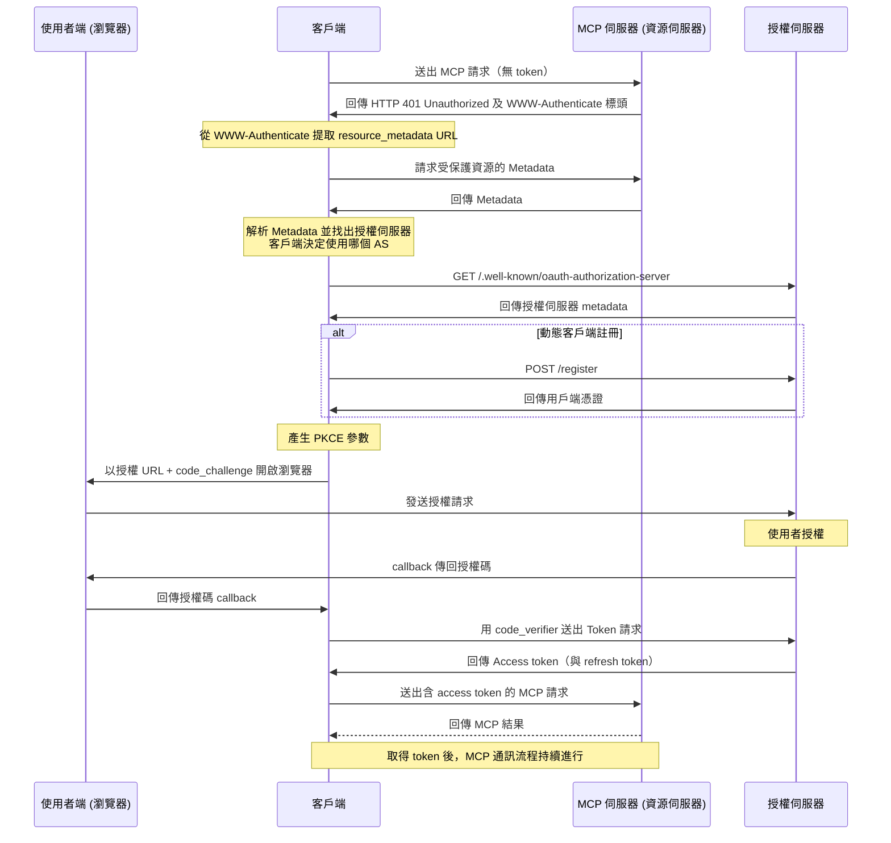

# mcp-workshop

[English](README.md) | 繁體中文 | [簡體中文](README.zh-CN.md)

本工作坊提供使用 [Go 程式語言][2] 構建 MCP（[Model Context Protocol][1]）伺服器及客戶端的完整指南。您將學會如何利用 MCP 來簡化工作流程並提升開發環境。

## 目錄

- [mcp-workshop](#mcp-workshop)
  - [目錄](#目錄)
  - [課程模組總覽](#課程模組總覽)
    - [01. 基礎 MCP 伺服器（`01-basic-mcp`）](#01-基礎-mcp-伺服器01-basic-mcp)
    - [02. 基礎 Token 傳遞（`02-basic-token-passthrough`）](#02-基礎-token-傳遞02-basic-token-passthrough)
    - [03. OAuth MCP 伺服器（`03-oauth-mcp`）](#03-oauth-mcp-伺服器03-oauth-mcp)
    - [04. 可觀測性（`04-observability`）](#04-可觀測性04-observability)
    - [05. MCP Proxy（`05-mcp-proxy`）](#05-mcp-proxy05-mcp-proxy)
  - [使用 .vscode/mcp.json](#使用-vscodemcpjson)
    - [結構](#結構)
      - [範例（`.vscode/mcp.json`）](#範例vscodemcpjson)
    - [用法](#用法)
  - [MCP Inspector](#mcp-inspector)
  - [MCP 的 OAuth](#mcp-的-oauth)
  - [MCP 漏洞](#mcp-漏洞)


📖 [簡報：用 Golang 建構 MCP (Model Context Protocol)](https://speakerdeck.com/appleboy/building-mcp-model-context-protocol-with-golang)

## 課程模組總覽

本工作坊由一系列實作模組組成，每個模組展現如何在 Go 中構建 MCP（Model Context Protocol）伺服器及其相關基礎架構。下表為各模組簡介：

### 01. 基礎 MCP 伺服器（[`01-basic-mcp`](01-basic-mcp/)）

提供雙通道（stdio 與 HTTP）的極簡 MCP 伺服器實作，採用 Gin 網頁框架。示範伺服器設置、工具註冊，以及最佳化的日誌與錯誤處理方式。

- **重點特色：** 支援 stdio/HTTP 二合一傳輸、整合 Gin、可擴展的工具註冊架構。

### 02. 基礎 Token 傳遞（[`02-basic-token-passthrough`](02-basic-token-passthrough/)）

說明如何於 context 內通過 HTTP header 或環境變數取得與傳遞憑證 token，確保 HTTP 與 stdio 傳輸皆適用，並供下游工具運用。

- **重點特色：** Token 傳遞、context 注入、認證請求範例工具。

### 03. OAuth MCP 伺服器（[`03-oauth-mcp`](03-oauth-mcp/)）

展現利用 OAuth 2.0 保護的 MCP 伺服器，包括授權、換取 token 與資源 metadata 的端點。支援 context token 處理與認證 API 範例工具。

- **重點特色：** OAuth 2.0 流程、保護端點、context token 傳遞、API 認證範例。

### 04. 可觀測性（[`04-observability`](04-observability/)）

聚焦於 MCP 伺服器的可觀測性與追蹤。整合 OpenTelemetry 與結構化日誌記錄，提供詳細追蹤、指標紀錄與錯誤回報。

- **重點特色：** OpenTelemetry 追蹤、結構化日誌、可觀測中介軟體、錯誤上報。

### 05. MCP Proxy（[`05-mcp-proxy`](05-mcp-proxy/)）

彙集多個 MCP 資源伺服器於單一 HTTP 端點的 Proxy 伺服器。簡化客戶端存取、支援即時資料串流、集中管理設定與安全性。

- **重點特色：** 多 MCP 伺服器統一入口、即時串流（SSE/HTTP）、彈性設定、強化安全性。

詳細指令與程式範例請參考各個模組的目錄與 `README.md`。

## 使用 .vscode/mcp.json

`.vscode/mcp.json` 用於在 VS Code 中設定 MCP 伺服器與相關帳密（如 API 金鑰），簡化伺服器切換及訊憑證管理，提升整體開發整合效率。

### 結構

- **inputs**：當開啟工作區時，提示使用者輸入必填值（如 API 金鑰）。例如：

  - `perplexity-key` – 以密碼模式安全儲存 Perplexity API Key。

- **servers**：定義已知的 MCP 伺服器連線（依名稱區分），包括協定、端點網址及必要時的 header。預設範例檔案包括：

  - `default-stdio-server` – 透過 stdio，以及 `mcp-server` 指令連結本地 MCP 伺服器。
  - `default-http-server` – 連線遠端 MCP 伺服器（HTTP），並傳送授權 header。
  - `default-oauth-server`、`proxy-server-01`、`proxy-server-02` – 其他 HTTP(S) 伺服器，可訂製 header 與端點。

#### 範例（`.vscode/mcp.json`）

```json
{
  "inputs": [
    {
      "type": "promptString",
      "id": "perplexity-key",
      "description": "Perplexity API Key",
      "password": true
    }
  ],
  "servers": {
    "default-stdio-server": {
      "type": "stdio",
      "command": "mcp-server",
      "args": ["-t", "stdio"]
    },
    "default-http-server": {
      "type": "http",
      "url": "http://localhost:8080/mcp",
      "headers": {
        "Authorization": "Bearer 1234567890"
      }
    }
    // ... 更多伺服器設定 ...
  }
}
```

### 用法

1. 將 `.vscode/mcp.json` 放於工作目錄或 `.vscode/` 目錄下。
2. 於 `inputs` 欄添加所需密鑰，必要時可自訂欄位。
3. 設定 `servers`，依需求註冊不同服務的連線資訊（包括類型、指令、參數、URL 與認證 header）。
4. 開啟工作區時，VS Code 及 MCP 相關擴充工具會自動提示輸入必要訊息並建立連線。

進階應用或特殊需求時，請直接編輯此檔案。集中設定有助於提升連線管理效率與開發體驗。

[1]: https://modelcontextprotocol.io/introduction
[2]: https://go.dev

## MCP Inspector

[MCP Inspector][01] 是專為測試、調試 MCP 伺服器而設計的開發工具。操作上類似 Postman，可發送請求並檢視回應，協助開發者流暢進行 MCP 伺服器互動與除錯。


[01]: https://github.com/modelcontextprotocol/inspector

## MCP 的 OAuth

下列圖示說明 MCP 內部 OAuth 流程，包括角色之間的通訊順序。


序列圖分別展示各角色間的溝通。


更多相關說明可參考 [Let's fix OAuth in MCP][3] 或 [MCP 授權][4] 文件。

[3]: https://aaronparecki.com/2025/04/03/15/oauth-for-model-context-protocol
[4]: https://modelcontextprotocol.io/specification/2025-03-26/basic/authorization

完整的 OAuth 取 Token 流程，請見 [MCP 規範](https://modelcontextprotocol.io/specification/draft/basic/authorization#authorization-flow-steps)，並參考文件下方的流程圖。請詳讀此圖，後續內容皆以此為基礎。



> [!注意]
> 遠端 MCP 伺服器目前「不支援」動態客戶端註冊。

## MCP 漏洞

以下為 MCP 常見漏洞：


- 指令注入（影響：中等 🟡）
- 工具污染（影響：嚴重 🔴）
- 藉由 SSE 開啟連線（影響：中等 🟠）
- 權限提升（影響：嚴重 🔴）
- 永續 context 濫用（影響：低，但有風險 🟡）
- 伺服器資料接管/偽造（影響：嚴重 🔴）

更多資訊請參閱 [MCP 漏洞][11]。

[11]: https://www.linkedin.com/posts/eordax_ai-mcp-genai-activity-7333057511651954688-sbNO
